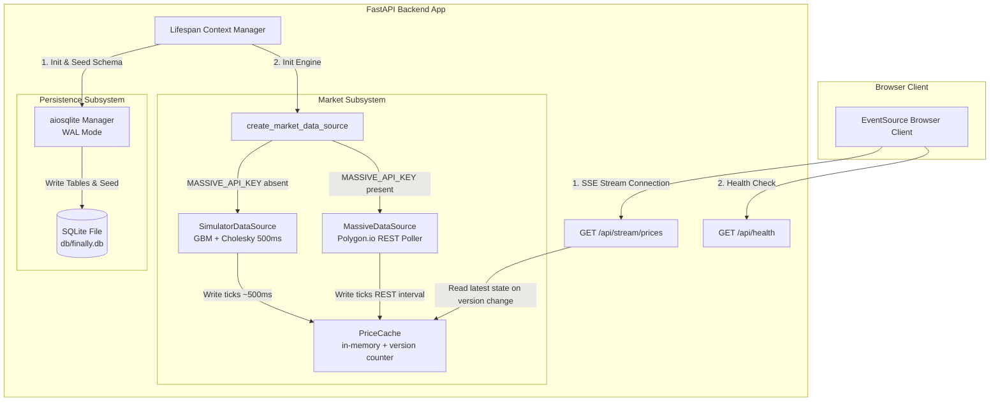

# Phase 1 Research: Backend Foundation, Database & Market Data Streaming Engine

**Phase:** Phase 1 — Backend Foundation, Database & Market Data Streaming Engine  
**Requirements Addressed:** BACK-01, DB-01, DB-02, MKT-01, MKT-02, MKT-03  
**Target Output File:** `.planning/phases/01-backend-foundation-database-market-data-streaming-engine/01-RESEARCH.md`

---

## 1. Summary & Architectural Responsibility Map

### Phase Objectives
Phase 1 establishes the core server-side foundation for FinAlly, an AI trading workstation. The primary goal is to provide a reliable, high-performance, asynchronous Python backend with automatic database initialization and a real-time Server-Sent Events (SSE) price streaming engine.

Key deliverables for this phase include:
1. **BACK-01**: FastAPI project setup inside `backend/` using `uv` dependency management (`pyproject.toml`) and `/api/health` endpoint.
2. **DB-01**: SQLite lazy schema auto-initialization at `db/finally.db` with all 6 required core tables (`users_profile`, `watchlist`, `positions`, `trades`, `portfolio_snapshots`, `chat_messages`).
3. **DB-02**: Automatic database seeding on initial startup ($10,000 cash balance for `id="default"`, and 10 default tickers in `watchlist`).
4. **MKT-01**: Abstract market data interface supporting both an in-process Geometric Brownian Motion (GBM) simulator (500ms ticks, Cholesky correlated sector moves, random shock events) and an optional Polygon.io REST polling client (`MassiveDataSource`).
5. **MKT-02**: Thread-safe in-memory `PriceCache` storing latest price, previous price, direction, change, and timestamp for all tickers, with version-based change tracking.
6. **MKT-03**: SSE streaming endpoint `/api/stream/prices` pushing formatted JSON price ticks to connected clients at ~500ms intervals.

### Architectural Responsibility Map

| Module / Component | Primary Responsibility | Key Interfaces / Exports |
|--------------------|------------------------|--------------------------|
| `backend/pyproject.toml` | Project configuration and `uv` dependency specification | FastAPI, uvicorn, aiosqlite, pydantic, sse-starlette, numpy, massive-api |
| `backend/app/main.py` | FastAPI application entrypoint & lifespan context manager | `app`, `@asynccontextmanager lifespan` |
| `backend/app/config.py` | Environment variable loading and configuration management | `Settings`, `get_settings()` (`MASSIVE_API_KEY`, `OPENROUTER_API_KEY`, `LLM_MOCK`, `DB_PATH`) |
| `backend/app/db/database.py` | Asynchronous SQLite connection management with WAL mode and lazy schema init | `get_db()`, `init_db()`, `get_db_path()` |
| `backend/app/db/schema.py` | DDL execution scripts and initial seeding logic | `CREATE_TABLES_SQL`, `seed_initial_data()` |
| `backend/app/market/models.py` | Price update data structure representations | `PriceUpdate` dataclass / Pydantic model |
| `backend/app/market/interface.py` | Abstract base class for market data providers | `MarketDataSource(ABC)` (`start()`, `stop()`, `add_ticker()`, `remove_ticker()`, `get_tickers()`) |
| `backend/app/market/cache.py` | Thread-safe, in-memory cache for ticker prices and update state versioning | `PriceCache` (`set()`, `get()`, `get_all()`, `version`) |
| `backend/app/market/simulator.py` | Geometric Brownian Motion engine with Cholesky sector correlation matrix | `GBMSimulator`, `SimulatorDataSource` |
| `backend/app/market/massive_client.py` | Polygon.io REST polling implementation | `MassiveDataSource` |
| `backend/app/market/factory.py` | Market data source selection based on environment configuration | `create_market_data_source()` |
| `backend/app/api/health.py` | Health check route | `GET /api/health` |
| `backend/app/api/stream.py` | SSE price stream route factory | `GET /api/stream/prices` via `EventSourceResponse` |

---

## 2. Standard Stack

### Technology Choices & Specifications

```
                       ┌─────────────────────────────────────────┐
                       │          FastAPI (Python 3.12)          │
                       └────────────────────┬────────────────────┘
                                            │
           ┌────────────────────────────────┼────────────────────────────────┐
           │                                │                                │
┌──────────▼──────────┐          ┌──────────▼──────────┐          ┌──────────▼──────────┐
│   aiosqlite + WAL   │          │  sse-starlette SSE  │          │  NumPy GBM Engine   │
│   (SQLite db/file)  │          │ (/api/stream/prices)│          │  (Correlated Ticks) │
└─────────────────────┘          └─────────────────────┘          └─────────────────────┘
```

1. **Python Runtime & Dependency Management**:
   - **Python 3.12+**
   - **`uv` package manager**: Modern, ultra-fast Python package resolver and environment manager using `pyproject.toml` (standardized packaging via Hatchling or Setuptools).
2. **Web Framework & Server**:
   - **FastAPI (0.110+)**: High-performance async web framework built on Starlette and Pydantic v2.
   - **Uvicorn (with standard extras)**: ASGI web server implementation supporting `uvloop` and `httptools`.
3. **Database & Persistence**:
   - **`aiosqlite`**: Asynchronous wrapper around standard Python `sqlite3`, enabling non-blocking database queries within FastAPI async endpoints.
   - **SQLite with WAL Mode**: Enable Write-Ahead Logging (`PRAGMA journal_mode=WAL;`) and `PRAGMA busy_timeout = 5000;` to allow simultaneous reads while background tasks or endpoints execute writes.
4. **Real-Time Data Push**:
   - **`sse-starlette`**: Provides `EventSourceResponse` for SSE endpoints. Handles client connection dropouts, auto-formatting (`data: ...\n\n`), and periodic ping frames (`: ping\n\n`) to keep connections alive through proxies and firewalls.
5. **Numerical Simulation**:
   - **`numpy`**: Fast matrix computation for Cholesky decomposition of covariance matrices to simulate realistic correlated stock price movements across market sectors (e.g. tech stocks moving together).

---

## 3. Architecture Patterns & Diagram

### Pattern 1: FastAPI Lifespan Resource Management
FastAPI's `@asynccontextmanager` lifespan event handler controls the startup and shutdown sequence of global services:
1. **Startup**:
   - Resolves the absolute database path (`db/finally.db`), creates parent directories if needed.
   - Triggers lazy DB schema auto-initialization and seeding (`init_db()`).
   - Instantiates `PriceCache`.
   - Invokes `create_market_data_source(cache)` to instantiate `SimulatorDataSource` (or `MassiveDataSource` if `MASSIVE_API_KEY` is present).
   - Starts the background market tick task with default tickers (`AAPL`, `GOOGL`, `MSFT`, `AMZN`, `TSLA`, `NVDA`, `META`, `JPM`, `V`, `NFLX`).
2. **Shutdown**:
   - Gracefully stops the background market data producer task (`await source.stop()`).

### Pattern 2: Producer-Cache-Consumer (Decoupled SSE Push)
To prevent market data producers from maintaining direct references to SSE HTTP request sockets:
- **Producer**: The `GBMSimulator` (or `MassiveDataSource`) background task generates updated prices every 500ms and updates `PriceCache`.
- **Cache**: `PriceCache` maintains an internal integer `_version`. Every price update increments `_version`.
- **Consumer**: Each client connected to `GET /api/stream/prices` runs an async generator loop that checks if `PriceCache.version` has changed. When a new version is detected, it formats all latest ticker updates as a single SSE event payload and streams it to the browser.

### Architecture Flow Diagram



---

## 4. Don't Hand-Roll

| Component | Standard Tool | Risk of Hand-Rolling |
|-----------|---------------|──────────────────────|
| **SSE Event Formatting & Keep-Alives** | `sse-starlette` (`EventSourceResponse`) | Hand-rolled SSE string generators often omit proper double newline (`\n\n`) delimiters or periodic comment pings (`: ping\n\n`), resulting in dropped connections, memory leaks from zombie clients, or browser reconnect loops. |
| **Correlated Multi-Asset Random Variables** | `numpy.random.multivariate_normal` / `numpy.linalg.cholesky` | Generating independent random numbers for each stock makes tech stocks move completely out-of-sync, destroying realism. Attempting manual correlation formulas without Cholesky decomposition leads to non-positive-definite covariance matrix runtime errors. |
| **Async Database Drivers for SQLite** | `aiosqlite` | Using standard Python `sqlite3` directly inside FastAPI async endpoints blocks the main asyncio thread loop during file I/O, causing API latency spikes and degraded SSE tick delivery. |
| **Environment Variable Management** | `pydantic-settings` / `Pydantic BaseSettings` | Custom `os.getenv()` calls scatter default values and string-to-type parsing throughout code, creating subtle bugs when env variables are empty strings vs `None`. |

---

## 5. Common Pitfalls

### Pitfall 1: SQLite Connection Locking in Async Background Tasks
- **Symptom**: `sqlite3.OperationalError: database is locked` occurs when simultaneous HTTP requests or snapshot background tasks write to SQLite.
- **Cause**: Standard SQLite operating mode locks the database file exclusively during write transactions.
- **Prevention**:
  1. Execute `PRAGMA journal_mode=WAL;` on database initialization. Write-Ahead Logging allows concurrent readers alongside a writer.
  2. Set `PRAGMA busy_timeout = 5000;` (5000ms timeout) so SQLite retries automatically instead of throwing an immediate lock error.
  3. Ensure write transactions are brief and closed cleanly.

### Pitfall 2: Client Disconnect Zombie Loops in SSE Endpoints
- **Symptom**: Server CPU spikes or unhandled exceptions accumulate as clients disconnect and reconnect.
- **Cause**: An `async for` or `while True` loop streaming events via Starlette `StreamingResponse` will continue running even after the HTTP connection is closed by the browser client, unless disconnect checks are performed.
- **Prevention**:
  - `sse-starlette` handles connection cancellation by catching `asyncio.CancelledError`.
  - In generator loops, explicitly evaluate `if await request.is_disconnected(): break` before sleeping or fetching cache updates.

### Pitfall 3: GBM Price Drift Explosion / Negative Prices
- **Symptom**: Simulated stock prices drift to $0.00 or explode to infinity over long running sessions.
- **Cause**: Uncalibrated Geometric Brownian Motion parameters (\(\mu\) drift and \(\sigma\) volatility) when applied per 500ms tick without scaling.
- **Formula**:
  \[
  S_{t+\Delta t} = S_t \exp\left( \left(\mu - \frac{1}{2}\sigma^2\right)\Delta t + \sigma \sqrt{\Delta t} Z \right)
  \]
- **Prevention**:
  - Scale drift \(\mu\) and volatility \(\sigma\) by time step \(\Delta t = 0.5 / 86400\) (or calibrated per-tick scale factors).
  - Enforce a hard lower bound on simulated stock prices (e.g. `max(0.01, calculated_price)`).

### Pitfall 4: Relative Path Ambiguity for SQLite File
- **Symptom**: Database file created in root directory when running locally, but in `/backend` or `/app` inside Docker, losing volume persistence.
- **Cause**: Relative path `"db/finally.db"` resolves relative to the current working directory (`CWD`) of the Python process.
- **Prevention**: Compute absolute path dynamically relative to project root or use an environment variable:
  ```python
  BASE_DIR = Path(__file__).resolve().parent.parent.parent  # Points to project root
  DEFAULT_DB_PATH = BASE_DIR / "db" / "finally.db"
  ```

---

## 6. Code Examples

### 6.1 `pyproject.toml` Configuration for `uv`
```toml
[build-system]
requires = ["hatchling"]
build-backend = "hatchling.build"

[project]
name = "finally-backend"
version = "0.1.0"
description = "FinAlly AI Trading Workstation Backend"
readme = "README.md"
requires-python = ">=3.12"
dependencies = [
    "fastapi>=0.110.0",
    "uvicorn[standard]>=0.28.0",
    "aiosqlite>=0.20.0",
    "pydantic>=2.6.0",
    "pydantic-settings>=2.2.0",
    "sse-starlette>=2.0.0",
    "numpy>=1.26.0",
    "massive-api>=0.1.0",
]

[project.optional-dependencies]
dev = [
    "pytest>=8.0.0",
    "pytest-asyncio>=0.23.0",
    "httpx>=0.27.0",
]

[tool.hatch.build.targets.wheel]
packages = ["app"]

[tool.pytest.ini_options]
asyncio_mode = "auto"
testpaths = ["tests"]
```

### 6.2 Lazy Schema Initialization & Seeding (`app/db/database.py`)
```python
import os
import aiosqlite
from pathlib import Path
import logging

logger = logging.getLogger("finally.db")

CREATE_TABLES_SQL = """
PRAGMA journal_mode=WAL;
PRAGMA busy_timeout=5000;

CREATE TABLE IF NOT EXISTS users_profile (
    id TEXT PRIMARY KEY DEFAULT 'default',
    cash_balance REAL NOT NULL DEFAULT 10000.0,
    created_at TEXT NOT NULL DEFAULT (datetime('now'))
);

CREATE TABLE IF NOT EXISTS watchlist (
    id TEXT PRIMARY KEY,
    user_id TEXT NOT NULL DEFAULT 'default',
    ticker TEXT NOT NULL,
    added_at TEXT NOT NULL DEFAULT (datetime('now')),
    UNIQUE(user_id, ticker)
);

CREATE TABLE IF NOT EXISTS positions (
    id TEXT PRIMARY KEY,
    user_id TEXT NOT NULL DEFAULT 'default',
    ticker TEXT NOT NULL,
    quantity REAL NOT NULL DEFAULT 0.0,
    avg_cost REAL NOT NULL DEFAULT 0.0,
    updated_at TEXT NOT NULL DEFAULT (datetime('now')),
    UNIQUE(user_id, ticker)
);

CREATE TABLE IF NOT EXISTS trades (
    id TEXT PRIMARY KEY,
    user_id TEXT NOT NULL DEFAULT 'default',
    ticker TEXT NOT NULL,
    side TEXT NOT NULL CHECK(side IN ('buy', 'sell')),
    quantity REAL NOT NULL,
    price REAL NOT NULL,
    executed_at TEXT NOT NULL DEFAULT (datetime('now'))
);

CREATE TABLE IF NOT EXISTS portfolio_snapshots (
    id TEXT PRIMARY KEY,
    user_id TEXT NOT NULL DEFAULT 'default',
    total_value REAL NOT NULL,
    recorded_at TEXT NOT NULL DEFAULT (datetime('now'))
);

CREATE TABLE IF NOT EXISTS chat_messages (
    id TEXT PRIMARY KEY,
    user_id TEXT NOT NULL DEFAULT 'default',
    role TEXT NOT NULL CHECK(role IN ('user', 'assistant')),
    content TEXT NOT NULL,
    actions TEXT,
    created_at TEXT NOT NULL DEFAULT (datetime('now'))
);
"""

DEFAULT_TICKERS = ["AAPL", "GOOGL", "MSFT", "AMZN", "TSLA", "NVDA", "META", "JPM", "V", "NFLX"]

async def init_db(db_path: Path) -> None:
    """Initialize database tables and default seed data if not present."""
    db_path.parent.mkdir(parents=True, exist_ok=True)
    async with aiosqlite.connect(db_path) as db:
        await db.executescript(CREATE_TABLES_SQL)
        await db.commit()
        
        # Check and seed user profile
        async with db.execute("SELECT id FROM users_profile WHERE id = 'default'") as cursor:
            if not await cursor.fetchone():
                await db.execute(
                    "INSERT INTO users_profile (id, cash_balance) VALUES ('default', 10000.0)"
                )
                logger.info("Seeded default user profile with $10,000 balance.")

        # Check and seed watchlist
        async with db.execute("SELECT COUNT(*) FROM watchlist WHERE user_id = 'default'") as cursor:
            count = (await cursor.fetchone())[0]
            if count == 0:
                import uuid
                from datetime import datetime, timezone
                now = datetime.now(timezone.utc).isoformat()
                seed_rows = [
                    (str(uuid.uuid4()), "default", ticker, now)
                    for ticker in DEFAULT_TICKERS
                ]
                await db.executemany(
                    "INSERT INTO watchlist (id, user_id, ticker, added_at) VALUES (?, ?, ?, ?)",
                    seed_rows
                )
                logger.info(f"Seeded watchlist with {len(DEFAULT_TICKERS)} default tickers.")

        await db.commit()
```

### 6.3 Thread-Safe Price Cache (`app/market/cache.py`)
```python
import threading
from typing import Dict, Optional, List
from app.market.models import PriceUpdate

class PriceCache:
    """Thread-safe in-memory cache for ticker prices with update versioning."""
    def __init__(self):
        self._lock = threading.Lock()
        self._cache: Dict[str, PriceUpdate] = {}
        self._version: int = 0

    @property
    def version(self) -> int:
        with self._lock:
            return self._version

    def set(self, update: PriceUpdate) -> None:
        with self._lock:
            self._cache[update.ticker] = update
            self._version += 1

    def set_many(self, updates: List[PriceUpdate]) -> None:
        if not updates:
            return
        with self._lock:
            for update in updates:
                self._cache[update.ticker] = update
            self._version += 1

    def get(self, ticker: str) -> Optional[PriceUpdate]:
        with self._lock:
            return self._cache.get(ticker)

    def get_all(self) -> Dict[str, PriceUpdate]:
        with self._lock:
            return dict(self._cache)
```

### 6.4 Geometric Brownian Motion Simulator (`app/market/simulator.py`)
```python
import asyncio
import numpy as np
from datetime import datetime, timezone
from typing import List, Dict
from app.market.models import PriceUpdate
from app.market.cache import PriceCache

class GBMSimulator:
    """GBM Price Simulator with Cholesky sector correlation and shock events."""
    def __init__(self, cache: PriceCache, tickers: List[str], initial_prices: Dict[str, float]):
        self.cache = cache
        self.tickers = tickers
        self.prices = dict(initial_prices)
        self.num_tickers = len(tickers)
        
        # Sector correlation matrix setup
        corr_matrix = np.full((self.num_tickers, self.num_tickers), 0.3)
        np.fill_diagonal(corr_matrix, 1.0)
        # Tech sector correlation (0..6) = 0.6
        for i in range(7):
            for j in range(7):
                if i != j:
                    corr_matrix[i, j] = 0.6
        # Finance sector correlation (7..8) = 0.5
        corr_matrix[7, 8] = 0.5
        corr_matrix[8, 7] = 0.5
        
        self.L = np.linalg.cholesky(corr_matrix)
        self.dt = 0.5 / 86400.0  # 500ms in days
        self.mu = 0.0001
        self.sigma = 0.015

    def tick((self) -> List[PriceUpdate]:
        uncorrelated = np.random.normal(0, 1, self.num_tickers)
        correlated = self.L @ uncorrelated
        
        updates = []
        now_iso = datetime.now(timezone.utc).isoformat()
        
        for idx, ticker in enumerate(self.tickers):
            prev_price = self.prices[ticker]
            
            # Shock event check (~0.1% chance)
            shock = 1.0
            if np.random.random() < 0.001:
                shock = 1.0 + np.random.uniform(-0.05, 0.05)
                
            drift = (self.mu - 0.5 * self.sigma**2) * self.dt
            diffusion = self.sigma * np.sqrt(self.dt) * correlated[idx]
            new_price = max(0.01, round(prev_price * np.exp(drift + diffusion) * shock, 2))
            
            self.prices[ticker] = new_price
            change = round(new_price - prev_price, 2)
            direction = "up" if change > 0 else ("down" if change < 0 else "flat")
            
            update = PriceUpdate(
                ticker=ticker,
                price=new_price,
                previous_price=prev_price,
                timestamp=now_iso,
                change=change,
                direction=direction
            )
            updates.append(update)
            
        self.cache.set_many(updates)
        return updates
```

### 6.5 SSE Price Stream Route (`app/api/stream.py`)
```python
import asyncio
import json
from fastapi import APIRouter, Request
from sse_starlette.sse import EventSourceResponse
from app.market.cache import PriceCache

def create_stream_router(cache: PriceCache) -> APIRouter:
    router = APIRouter()

    @router.get("/api/stream/prices")
    async def stream_prices(request: Request):
        async def event_generator():
            last_version = -1
            while True:
                if await request.is_disconnected():
                    break
                    
                current_version = cache.version
                if current_version != last_version:
                    last_version = current_version
                    all_ticks = cache.get_all()
                    payload = [tick.dict() for tick in all_ticks.values()]
                    yield {
                        "event": "price_update",
                        "data": json.dumps(payload)
                    }
                await asyncio.sleep(0.5)

        return EventSourceResponse(event_generator())

    return router
```

---

## 7. Validation Architecture

### Automated Verification Strategy
Verification of Phase 1 requirements relies on unit, integration, and endpoint tests written in `pytest` under `backend/tests/`.

```
backend/tests/
├── test_health.py        # Validates BACK-01 (/api/health endpoint)
├── test_database.py      # Validates DB-01 and DB-02 (lazy schema init & seed verification)
├── test_cache.py         # Validates MKT-02 (PriceCache get/set/version increment)
├── test_simulator.py     # Validates MKT-01 (GBM calculations, correlated moves, shocks)
└── test_stream.py        # Validates MKT-03 (SSE streaming price tick response)
```

### Key Test Commands
```bash
# Run complete Phase 1 test suite using uv
cd backend
uv run pytest -v
```

### Requirement-to-Test Mapping

| Requirement | Test File | Test Method / Assertions |
|-------------|-----------|──────────────────────────|
| **BACK-01** | `test_health.py` | `test_health_returns_200()`: Verifies GET `/api/health` returns status HTTP 200 with JSON payload `{"status": "ok"}`. |
| **DB-01** | `test_database.py` | `test_tables_created()`: Inspects `sqlite_master` table to confirm `users_profile`, `watchlist`, `positions`, `trades`, `portfolio_snapshots`, and `chat_messages` exist. |
| **DB-02** | `test_database.py` | `test_initial_seeding()`: Confirms `users_profile` has cash balance of `$10000.0` for `id='default'`, and `watchlist` contains exactly 10 default tickers (`AAPL`, `GOOGL`, etc.). |
| **MKT-01** | `test_simulator.py` | `test_gbm_tick_updates_prices()`: Verifies `tick()` updates all ticker prices, respects correlation matrix, and keeps prices positive. |
| **MKT-02** | `test_cache.py` | `test_cache_version_increment()`: Asserts that `set()` updates internal `PriceCache` state and increments `version` monotonically. |
| **MKT-03** | `test_stream.py` | `test_sse_stream_endpoint()`: Uses `httpx.AsyncClient` to open GET `/api/stream/prices` stream, verifying content type `text/event-stream` and parsing valid JSON tick events. |

---

## 8. Security Domain

1. **Authentication Scope**:
   - Single-user workstation model: Application hardcodes `user_id="default"` for all database rows. Authentication is out of scope for v1.
2. **SQL Injection Prevention**:
   - All SQLite database interactions MUST use parameter binding (`?` placeholders with `aiosqlite`) rather than string interpolation or f-strings.
3. **Secrets Isolation**:
   - `MASSIVE_API_KEY` and `OPENROUTER_API_KEY` are read exclusively from environment variables or root `.env`. They must never be committed to git or exposed in client-facing API responses.
4. **Local Network Exposure**:
   - Default server binding should be set to `127.0.0.1` during standalone local development, and `0.0.0.0` only when executing within Docker container environment.
