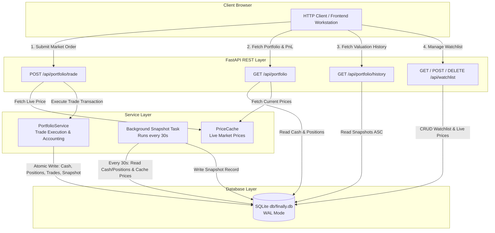

# Phase 2 Research: Portfolio Engine, Trading & Watchlist REST APIs

**Phase:** Phase 2 — Portfolio Engine, Trading & Watchlist REST APIs  
**Requirements Addressed:** PORT-01, PORT-02, PORT-03, WATCH-01  
**Target Output File:** `.planning/phases/02-portfolio-engine-trading-watchlist-rest-apis/02-RESEARCH.md`

---

## 1. Summary & Architectural Responsibility Map

### Phase Objectives
Phase 2 builds the portfolio accounting engine, market order trade execution engine, automated snapshot background service, and watchlist management REST APIs on top of the Phase 1 backend foundation.

Key deliverables for this phase include:
1. **PORT-01**: REST endpoint `GET /api/portfolio` returning positions, cash balance, total portfolio market value, position cost basis, and total unrealized P&L (dollar and percentage).
2. **PORT-02**: REST endpoint `POST /api/portfolio/trade` executing instant market buy/sell orders, validating available cash/position balance, updating weighted average cost on buys, preserving cost basis on sells, logging trade audit rows, and triggering an immediate portfolio snapshot.
3. **PORT-03**: Periodic 30-second background snapshot task and post-trade snapshot trigger populating `portfolio_snapshots`, exposed via `GET /api/portfolio/history`.
4. **WATCH-01**: REST endpoints `GET /api/watchlist`, `POST /api/watchlist`, and `DELETE /api/watchlist/{ticker}` with dynamic market source integration for ticker tracking.

### Architectural Responsibility Map

| Module / Component | Primary Responsibility | Key Interfaces / Exports |
|--------------------|------------------------|--------------------------|
| `backend/app/schemas/portfolio.py` | Pydantic schemas for portfolio, trade, snapshot, and watchlist requests/responses | `TradeRequest`, `TradeResponse`, `PositionItem`, `PortfolioResponse`, `SnapshotResponse`, `WatchlistAddRequest`, `WatchlistItemResponse` |
| `backend/app/services/portfolio_service.py` | Core domain business logic for trade execution, position weighted-average cost, portfolio valuation, and snapshot recording | `execute_trade()`, `calculate_portfolio()`, `record_snapshot()` |
| `backend/app/services/snapshot_service.py` | Background `asyncio` task loop recording total portfolio value snapshots every 30s | `SnapshotTask`, `start_snapshot_task()`, `stop_snapshot_task()` |
| `backend/app/api/portfolio.py` | REST API routes for `/api/portfolio`, `/api/portfolio/trade`, and `/api/portfolio/history` | `GET /api/portfolio`, `POST /api/portfolio/trade`, `GET /api/portfolio/history` |
| `backend/app/api/watchlist.py` | REST API routes for `/api/watchlist` CRUD operations | `GET /api/watchlist`, `POST /api/watchlist`, `DELETE /api/watchlist/{ticker}` |
| `backend/app/market/interface.py` & `simulator.py` | Dynamic ticker management extensions | `add_ticker()`, `remove_ticker()` |

---

## 2. Standard Stack

### Technology Choices & Specifications

```
                           ┌─────────────────────────────────────────┐
                           │          FastAPI (Python 3.12)          │
                           └────────────────────┬────────────────────┘
                                                │
       ┌───────────────────────────────┬────────┴───────────────────────┬───────────────────────────────┐
       │                               │                                │                               │
┌──────▼──────────────┐     ┌──────────▼──────────┐          ┌──────────▼──────────┐          ┌──────────▼──────────┐
│ Pydantic v2 Schemas │     │  aiosqlite Engine   │          │  PriceCache Integration│     │ Snapshot Task Loop  │
│ (Request & Response)│     │(Atomic Transactions)│          │ (Live Price Lookup) │     │ (30s Background)    │
└─────────────────────┘     └─────────────────────┘          └─────────────────────┘          └─────────────────────┘
```

1. **Web Framework & Request Validation**:
   - **FastAPI / Pydantic v2**: Strict input validation (`Field(gt=0)` for quantities, regex pattern for ticker formats) and automatic JSON serialization.
2. **Persistence & Concurrency Control**:
   - **`aiosqlite` Transactions**: Explicit transaction blocks (`async with db:` or `await db.begin()`) ensuring cash updates, position changes, trade audit records, and snapshot triggers commit atomically or roll back cleanly.
   - **WAL Mode & Busy Timeout**: WAL mode (`PRAGMA journal_mode=WAL;`) and 5s timeout (`PRAGMA busy_timeout=5000;`) configured in Phase 1 permit non-blocking concurrent writes between user trades and the 30s background snapshot worker.
3. **In-Memory Price Lookup**:
   - **`PriceCache` Integration**: Direct lookup of live asset prices during trade validation, portfolio P&L valuation, and background snapshot calculations.
4. **Async Task Scheduling**:
   - **Native `asyncio.create_task`**: Light-weight, zero-dependency background loop managed within the FastAPI `lifespan` context.

---

## 3. Architecture Patterns & Diagram

### Pattern 1: Domain Service Layer Separation
To ensure clean architecture and testability:
- **Routes (`api/portfolio.py`, `api/watchlist.py`)**: Handle HTTP parameters, dependency injection (database connection, `PriceCache`, `MarketDataSource`), and exception transformation into `HTTPException`.
- **Services (`services/portfolio_service.py`)**: Implement core trading logic, accounting math, SQLite transactions, and valuation formulas independent of HTTP details.

### Pattern 2: Atomic Trade Execution & Instant Snapshot Trigger
When a market trade is placed:
1. Market price is retrieved from `PriceCache`.
2. A single SQLite transaction modifies `users_profile` cash balance, updates or inserts the `positions` row, and appends a record to `trades`.
3. Immediately before committing (or right after), a portfolio snapshot is recorded in `portfolio_snapshots` to guarantee immediate UI chart responsiveness.

### Architecture Flow Diagram



---

## 4. Don't Hand-Roll

| Component | Standard Tool | Risk of Hand-Rolling |
|-----------|---------------|──────────────────────|
| **Request Payload & Enum Validation** | Pydantic v2 `BaseModel` & `Field` | Hand-written string checking for side (`buy`/`sell`), non-numeric quantities, or invalid ticker formats leads to untracked edge cases, unhandled 500 errors, or database constraint failures. |
| **Weighted Average Cost Basis Logic** | Formally defined financial accounting formulas | Custom or intuitive recalculations on stock sells frequently corrupt portfolio unrealized P&L calculations. Recalculating average cost on sell operations is a common accounting bug. |
| **Atomic Multi-Table Updates** | `aiosqlite` transaction context managers | Executing raw independent SQL `UPDATE` statements without atomic transactions risks leaving cash balances updated while position records fail, permanently desynchronizing user balances. |
| **Background Loop Exception Recovery** | Standard `try...except` inside `while True:` loop | Unhandled exceptions inside a background task loop permanently terminate the task, causing background snapshot generation to silently stop working until server restart. |

---

## 5. Common Pitfalls

### Pitfall 1: Recalculating Average Cost Basis on Share Sells
- **Symptom**: Portfolio unrealized P&L percentage becomes incorrect or negative when closing partial position profits.
- **Accounting Rule**:
  - **BUY**: Increments position quantity and recalculates weighted average cost basis:
    \[
    \text{avg\_cost}_{\text{new}} = \frac{(Q_{\text{old}} \times \text{avg\_cost}_{\text{old}}) + (Q_{\text{buy}} \times P_{\text{trade}})}{Q_{\text{old}} + Q_{\text{buy}}}
    \]
  - **SELL**: Reduces position quantity \( Q_{\text{new}} = Q_{\text{old}} - Q_{\text{sell}} \). **Average cost per share DOES NOT CHANGE** (\(\text{avg\_cost}_{\text{new}} = \text{avg\_cost}_{\text{old}}\)). Profit or loss is realized into cash.
- **Prevention**: Ensure code paths for `SELL` explicitly retain the existing `avg_cost` value.

### Pitfall 2: Division by Zero in P&L Percentage Calculations
- **Symptom**: Server returns `HTTP 500 Internal Server Error` with `ZeroDivisionError` when position quantity or cost basis is 0.
- **Prevention**: Always guard percentage formulas:
  ```python
  unrealized_pnl_percent = (unrealized_pnl / cost_basis * 100.0) if cost_basis > 0 else 0.0
  ```

### Pitfall 3: Floating Point Rounding & Precision Inconsistencies
- **Symptom**: Cash balance exhibits residual micro-fractions (e.g. `$9999.999999999998`).
- **Prevention**: Apply explicit rounding (`round(val, 2)` or `round(qty, 4)` for fractional shares) when computing trade total execution cost, cash balances, and P&L metrics before storing in SQLite or returning in API responses.

### Pitfall 4: Missing Market Price for Trade Execution
- **Symptom**: User attempts to place a trade for a ticker immediately upon startup before `PriceCache` receives its first tick, resulting in `KeyError` or `NoneType` errors.
- **Prevention**: Explicitly validate price availability in `PriceCache`. If missing, fallback to default initial price or reject order with HTTP 400 (`"Market price currently unavailable for ticker {ticker}"`).

### Pitfall 5: SQLite Database Locking in Concurrent Background Tasks
- **Symptom**: Background snapshot task or trade submission fails with `sqlite3.OperationalError: database is locked`.
- **Prevention**:
  - Maintain short transaction durations.
  - Utilize Phase 1's `get_db()` context manager which sets `PRAGMA journal_mode=WAL;` and `PRAGMA busy_timeout=5000;`.

---

## 6. Code Examples

### 6.1 Pydantic Request & Response Schemas (`app/schemas/portfolio.py`)

```python
from datetime import datetime
from typing import List, Literal, Optional
from pydantic import BaseModel, Field, field_validator


class TradeRequest(BaseModel):
    ticker: str = Field(..., min_length=1, max_length=10, description="Stock ticker symbol")
    side: Literal["buy", "sell"] = Field(..., description="Trade direction: buy or sell")
    quantity: float = Field(..., gt=0, description="Quantity of shares to trade")

    @field_validator("ticker")
    @classmethod
    def sanitize_ticker(cls, v: str) -> str:
        return v.strip().upper()


class TradeResponse(BaseModel):
    trade_id: str
    ticker: str
    side: Literal["buy", "sell"]
    quantity: float
    price: float
    total_value: float
    cash_balance: float
    executed_at: str


class PositionItem(BaseModel):
    ticker: str
    quantity: float
    avg_cost: float
    current_price: float
    market_value: float
    unrealized_pnl: float
    unrealized_pnl_percent: float


class PortfolioResponse(BaseModel):
    cash_balance: float
    positions_value: float
    total_value: float
    total_unrealized_pnl: float
    total_unrealized_pnl_percent: float
    positions: List[PositionItem]


class SnapshotResponse(BaseModel):
    id: str
    total_value: float
    recorded_at: str


class WatchlistAddRequest(BaseModel):
    ticker: str = Field(..., min_length=1, max_length=10)

    @field_validator("ticker")
    @classmethod
    def sanitize_ticker(cls, v: str) -> str:
        return v.strip().upper()


class WatchlistItemResponse(BaseModel):
    id: str
    ticker: str
    price: float
    previous_price: float
    change: float
    direction: Literal["up", "down", "flat"]
    added_at: str
```

### 6.2 Trade Execution Service Logic (`app/services/portfolio_service.py`)

```python
import uuid
from datetime import datetime, timezone
from typing import Dict, Any
import aiosqlite

from app.market.cache import PriceCache
from app.schemas.portfolio import TradeRequest, TradeResponse


async def execute_trade(
    db: aiosqlite.Connection,
    cache: PriceCache,
    trade_req: TradeRequest,
    user_id: str = "default"
) -> TradeResponse:
    ticker = trade_req.ticker
    side = trade_req.side
    qty = trade_req.quantity

    # 1. Fetch live market price
    price_update = cache.get(ticker)
    if not price_update or price_update.price <= 0:
        raise ValueError(f"Market price unavailable for ticker: {ticker}")
    
    price = price_update.price
    trade_cost = round(qty * price, 2)
    now_iso = datetime.now(timezone.utc).isoformat()
    trade_id = str(uuid.uuid4())

    # Begin atomic transaction block
    async with db.execute("SELECT cash_balance FROM users_profile WHERE id = ?", (user_id,)) as cursor:
        row = await cursor.fetchone()
        if not row:
            raise ValueError(f"User profile '{user_id}' not found.")
        current_cash = row[0]

    # Fetch existing position
    async with db.execute(
        "SELECT quantity, avg_cost FROM positions WHERE user_id = ? AND ticker = ?",
        (user_id, ticker)
    ) as cursor:
        pos_row = await cursor.fetchone()
        existing_qty = pos_row[0] if pos_row else 0.0
        existing_avg_cost = pos_row[1] if pos_row else 0.0

    if side == "buy":
        if current_cash < trade_cost:
            raise ValueError(
                f"Insufficient funds: Trade requires ${trade_cost:.2f}, but cash balance is ${current_cash:.2f}"
            )
        new_cash = round(current_cash - trade_cost, 2)
        new_qty = round(existing_qty + qty, 4)
        # Weighted average cost calculation
        new_avg_cost = round(
            ((existing_qty * existing_avg_cost) + (qty * price)) / new_qty, 2
        )
    else:  # sell
        if existing_qty < qty:
            raise ValueError(
                f"Insufficient position: Cannot sell {qty} shares of {ticker}. Holding: {existing_qty}"
            )
        new_cash = round(current_cash + trade_cost, 2)
        new_qty = round(existing_qty - qty, 4)
        # Cost basis remains UNCHANGED on sell
        new_avg_cost = existing_avg_cost if new_qty > 0 else 0.0

    # Perform SQL updates atomically
    await db.execute(
        "UPDATE users_profile SET cash_balance = ? WHERE id = ?",
        (new_cash, user_id)
    )

    pos_id = str(uuid.uuid4())
    await db.execute(
        """
        INSERT INTO positions (id, user_id, ticker, quantity, avg_cost, updated_at)
        VALUES (?, ?, ?, ?, ?, ?)
        ON CONFLICT(user_id, ticker) DO UPDATE SET
            quantity = excluded.quantity,
            avg_cost = excluded.avg_cost,
            updated_at = excluded.updated_at
        """,
        (pos_id, user_id, ticker, new_qty, new_avg_cost, now_iso)
    )

    await db.execute(
        """
        INSERT INTO trades (id, user_id, ticker, side, quantity, price, executed_at)
        VALUES (?, ?, ?, ?, ?, ?, ?)
        """,
        (trade_id, user_id, ticker, side, qty, price, now_iso)
    )

    # Post-trade snapshot trigger
    await record_snapshot(db, cache, user_id)

    await db.commit()

    return TradeResponse(
        trade_id=trade_id,
        ticker=ticker,
        side=side,
        quantity=qty,
        price=price,
        total_value=trade_cost,
        cash_balance=new_cash,
        executed_at=now_iso
    )
```

### 6.3 Portfolio Calculation Logic (`app/services/portfolio_service.py`)

```python
async def calculate_portfolio(
    db: aiosqlite.Connection,
    cache: PriceCache,
    user_id: str = "default"
) -> PortfolioResponse:
    async with db.execute("SELECT cash_balance FROM users_profile WHERE id = ?", (user_id,)) as cursor:
        row = await cursor.fetchone()
        cash_balance = row[0] if row else 10000.0

    positions: List[PositionItem] = []
    positions_value = 0.0
    total_cost_basis = 0.0

    async with db.execute(
        "SELECT ticker, quantity, avg_cost FROM positions WHERE user_id = ? AND quantity > 0",
        (user_id,)
    ) as cursor:
        rows = await cursor.fetchall()
        for ticker, qty, avg_cost in rows:
            price_update = cache.get(ticker)
            current_price = price_update.price if price_update else avg_cost
            
            market_val = round(qty * current_price, 2)
            cost_basis = round(qty * avg_cost, 2)
            pnl = round(market_val - cost_basis, 2)
            pnl_pct = round((pnl / cost_basis * 100.0), 2) if cost_basis > 0 else 0.0

            positions_value += market_val
            total_cost_basis += cost_basis

            positions.append(
                PositionItem(
                    ticker=ticker,
                    quantity=qty,
                    avg_cost=avg_cost,
                    current_price=current_price,
                    market_value=market_val,
                    unrealized_pnl=pnl,
                    unrealized_pnl_percent=pnl_pct
                )
            )

    positions_value = round(positions_value, 2)
    total_value = round(cash_balance + positions_value, 2)
    total_pnl = round(positions_value - total_cost_basis, 2)
    total_pnl_pct = round((total_pnl / total_cost_basis * 100.0), 2) if total_cost_basis > 0 else 0.0

    return PortfolioResponse(
        cash_balance=cash_balance,
        positions_value=positions_value,
        total_value=total_value,
        total_unrealized_pnl=total_pnl,
        total_unrealized_pnl_percent=total_pnl_pct,
        positions=positions
    )
```

### 6.4 Background Snapshot Service (`app/services/snapshot_service.py`)

```python
import asyncio
import logging
import uuid
from datetime import datetime, timezone
from pathlib import Path
from app.db.database import get_db
from app.market.cache import PriceCache

logger = logging.getLogger("finally.snapshot")


async def record_snapshot(db, cache: PriceCache, user_id: str = "default") -> float:
    """Record current total portfolio value into portfolio_snapshots table."""
    async with db.execute("SELECT cash_balance FROM users_profile WHERE id = ?", (user_id,)) as cursor:
        row = await cursor.fetchone()
        cash = row[0] if row else 10000.0

    pos_value = 0.0
    async with db.execute(
        "SELECT ticker, quantity, avg_cost FROM positions WHERE user_id = ? AND quantity > 0",
        (user_id,)
    ) as cursor:
        async for ticker, qty, avg_cost in cursor:
            price_update = cache.get(ticker)
            price = price_update.price if price_update else avg_cost
            pos_value += (qty * price)

    total_val = round(cash + pos_value, 2)
    now_iso = datetime.now(timezone.utc).isoformat()
    snap_id = str(uuid.uuid4())

    await db.execute(
        "INSERT INTO portfolio_snapshots (id, user_id, total_value, recorded_at) VALUES (?, ?, ?, ?)",
        (snap_id, user_id, total_val, now_iso)
    )
    return total_val


class SnapshotTask:
    """30-second periodic portfolio snapshot background service."""

    def __init__(self, db_path: Path, cache: PriceCache, interval_seconds: int = 30):
        self.db_path = db_path
        self.cache = cache
        self.interval = interval_seconds
        self._task: Optional[asyncio.Task] = None
        self._running = False

    async def _run_loop(self):
        logger.info(f"Starting portfolio snapshot background task ({self.interval}s interval)...")
        while self._running:
            try:
                async with get_db(self.db_path) as db:
                    total_val = await record_snapshot(db, self.cache)
                    await db.commit()
                    logger.debug(f"Recorded background snapshot: ${total_val:.2f}")
            except Exception as e:
                logger.error(f"Error in snapshot background task: {e}")

            await asyncio.sleep(self.interval)

    def start(self):
        if not self._running:
            self._running = True
            self._task = asyncio.create_task(self._run_loop())

    async def stop(self):
        if self._running:
            self._running = False
            if self._task:
                self._task.cancel()
                try:
                    await self._task
                except asyncio.CancelledError:
                    pass
            logger.info("Stopped snapshot background task.")
```

### 6.5 Portfolio & Watchlist API Endpoints (`app/api/portfolio.py` & `app/api/watchlist.py`)

```python
# app/api/portfolio.py
from fastapi import APIRouter, Request, HTTPException, status
from app.schemas.portfolio import TradeRequest, TradeResponse, PortfolioResponse, SnapshotResponse
from app.services.portfolio_service import execute_trade, calculate_portfolio
from app.db.database import get_db

router = APIRouter(prefix="/api/portfolio", tags=["Portfolio"])

@router.get("", response_model=PortfolioResponse)
async def get_portfolio(request: Request):
    settings = request.app.state.settings if hasattr(request.app.state, "settings") else get_settings()
    async with get_db(settings.DB_PATH) as db:
        return await calculate_portfolio(db, request.app.state.price_cache)

@router.post("/trade", response_model=TradeResponse)
async def submit_trade(trade_req: TradeRequest, request: Request):
    settings = get_settings()
    async with get_db(settings.DB_PATH) as db:
        try:
            return await execute_trade(db, request.app.state.price_cache, trade_req)
        except ValueError as e:
            raise HTTPException(status_code=status.HTTP_400_BAD_REQUEST, detail=str(e))

@router.get("/history", response_model=List[SnapshotResponse])
async def get_portfolio_history(request: Request):
    settings = get_settings()
    async with get_db(settings.DB_PATH) as db:
        async with db.execute(
            "SELECT id, total_value, recorded_at FROM portfolio_snapshots WHERE user_id = 'default' ORDER BY recorded_at ASC"
        ) as cursor:
            rows = await cursor.fetchall()
            return [
                SnapshotResponse(id=r[0], total_value=r[1], recorded_at=r[2])
                for r in rows
            ]
```

```python
# app/api/watchlist.py
import uuid
from datetime import datetime, timezone
from fastapi import APIRouter, Request, HTTPException, status
from app.schemas.portfolio import WatchlistAddRequest, WatchlistItemResponse
from app.db.database import get_db

router = APIRouter(prefix="/api/watchlist", tags=["Watchlist"])

@router.get("", response_model=List[WatchlistItemResponse])
async def get_watchlist(request: Request):
    cache = request.app.state.price_cache
    settings = get_settings()
    async with get_db(settings.DB_PATH) as db:
        async with db.execute(
            "SELECT id, ticker, added_at FROM watchlist WHERE user_id = 'default' ORDER BY added_at ASC"
        ) as cursor:
            rows = await cursor.fetchall()
            result = []
            for item_id, ticker, added_at in rows:
                price_up = cache.get(ticker)
                price = price_up.price if price_up else 0.0
                prev = price_up.previous_price if price_up else 0.0
                change = price_up.change if price_up else 0.0
                direction = price_up.direction if price_up else "flat"
                result.append(
                    WatchlistItemResponse(
                        id=item_id,
                        ticker=ticker,
                        price=price,
                        previous_price=prev,
                        change=change,
                        direction=direction,
                        added_at=added_at
                    )
                )
            return result

@router.post("", response_model=WatchlistItemResponse, status_code=status.HTTP_201_CREATED)
async def add_watchlist(req: WatchlistAddRequest, request: Request):
    cache = request.app.state.price_cache
    market_source = getattr(request.app.state, "market_source", None)
    settings = get_settings()
    ticker = req.ticker

    async with get_db(settings.DB_PATH) as db:
        async with db.execute(
            "SELECT id FROM watchlist WHERE user_id = 'default' AND ticker = ?", (ticker,)
        ) as cursor:
            if await cursor.fetchone():
                raise HTTPException(status_code=400, detail=f"Ticker {ticker} is already in watchlist")

        item_id = str(uuid.uuid4())
        now_iso = datetime.now(timezone.utc).isoformat()
        await db.execute(
            "INSERT INTO watchlist (id, user_id, ticker, added_at) VALUES (?, 'default', ?, ?)",
            (item_id, ticker, now_iso)
        )
        await db.commit()

        if market_source and hasattr(market_source, "add_ticker"):
            market_source.add_ticker(ticker)

        price_up = cache.get(ticker)
        price = price_up.price if price_up else 100.0
        prev = price_up.previous_price if price_up else 100.0
        change = price_up.change if price_up else 0.0
        direction = price_up.direction if price_up else "flat"

        return WatchlistItemResponse(
            id=item_id, ticker=ticker, price=price, previous_price=prev,
            change=change, direction=direction, added_at=now_iso
        )

@router.delete("/{ticker}")
async def remove_watchlist(ticker: str, request: Request):
    ticker_clean = ticker.strip().upper()
    settings = get_settings()
    market_source = getattr(request.app.state, "market_source", None)

    async with get_db(settings.DB_PATH) as db:
        cursor = await db.execute(
            "DELETE FROM watchlist WHERE user_id = 'default' AND ticker = ?", (ticker_clean,)
        )
        await db.commit()
        if cursor.rowcount == 0:
            raise HTTPException(status_code=404, detail=f"Ticker {ticker_clean} not found in watchlist")

        if market_source and hasattr(market_source, "remove_ticker"):
            market_source.remove_ticker(ticker_clean)

        return {"status": "success", "ticker": ticker_clean}
```

---

## 7. Validation Architecture

### Automated Verification Strategy
Verification of Phase 2 requirements will be performed using standard `pytest` and `httpx.AsyncClient` test suites under `backend/tests/`.

```
backend/tests/
├── test_health.py        # Phase 1 Health check
├── test_database.py      # Phase 1 DB schema & seeding
├── test_cache.py         # Phase 1 Price Cache
├── test_simulator.py     # Phase 1 Market Data Engine
├── test_stream.py        # Phase 1 SSE Stream Endpoint
├── test_portfolio.py    # Phase 2: GET /api/portfolio, POST /api/portfolio/trade
├── test_history.py      # Phase 2: Snapshot background task & GET /api/portfolio/history
└── test_watchlist.py    # Phase 2: GET, POST, DELETE /api/watchlist
```

### Key Test Commands
```bash
# Run complete Phase 1 + Phase 2 test suite
cd backend
.venv/bin/pytest -v
```

### Requirement-to-Test Mapping

| Requirement | Test File | Test Method / Assertions |
|-------------|-----------|──────────────────────────|
| **PORT-01** | `test_portfolio.py` | `test_get_portfolio_initial()`: Verifies initial state returns `$10,000.0` cash, empty positions, and total value `$10,000.0`.<br/>`test_get_portfolio_with_positions()`: Verifies position market value and unrealized P&L calculations when positions exist. |
| **PORT-02** | `test_portfolio.py` | `test_trade_buy_success()`: Executes BUY order, asserts cash balance decreased, position quantity & avg_cost updated, and trade logged.<br/>`test_trade_buy_insufficient_funds()`: Attempts BUY exceeding cash balance, asserts HTTP 400 error.<br/>`test_trade_sell_success()`: Executes SELL order, asserts cash balance increased, position quantity reduced, avg_cost unchanged.<br/>`test_trade_sell_insufficient_position()`: Attempts SELL exceeding position qty, asserts HTTP 400. |
| **PORT-03** | `test_history.py` | `test_post_trade_snapshot_trigger()`: Confirms trade execution creates immediate snapshot in `portfolio_snapshots`.<br/>`test_background_snapshot_task()`: Verifies `SnapshotTask` records snapshots periodically and `GET /api/portfolio/history` returns ordered snapshots. |
| **WATCH-01** | `test_watchlist.py` | `test_get_watchlist()`: Asserts GET `/api/watchlist` returns initial 10 seeded tickers with cached prices.<br/>`test_add_watchlist_ticker()`: Asserts POST `/api/watchlist` inserts new ticker.<br/>`test_delete_watchlist_ticker()`: Asserts DELETE `/api/watchlist/{ticker}` removes ticker, returning 404 for missing ticker. |

---

## 8. Security Domain

1. **Trade Authorization & Input Validation**:
   - Validate trade quantities (`gt=0`), ticker length, and side choices (`buy`/`sell`) via Pydantic models.
   - Enforce upper-case normalization to prevent duplicate ticker entries under different cases (e.g. `aapl` vs `AAPL`).
2. **Transaction Integrity**:
   - Use atomic SQLite transactions for trade execution so cash deductions and position updates are coupled.
   - Enforce strict balance checks before database modifications to prevent negative cash balances or naked short positions.
3. **Database Parameter Binding**:
   - All SQL statements MUST use parameterized queries (`?` placeholders) to prevent SQL injection vulnerabilities.
