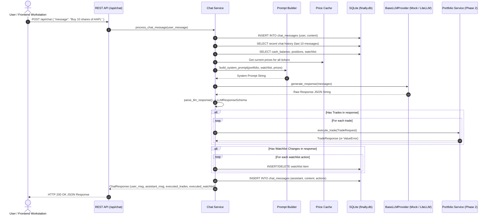

# Phase 3 Research: AI Copilot & Agentic Trade Execution

**Phase:** Phase 3 — AI Copilot & Agentic Trade Execution  
**Requirements Addressed:** AI-01, AI-02, AI-03, AI-04  
**Target Output File:** `.planning/phases/03-ai-copilot-agentic-trade-execution/03-RESEARCH.md`  

---

## 1. Summary & Architectural Responsibility Map

### Phase Objectives
Phase 3 introduces an intelligent AI Copilot and agentic trade execution engine into the FinAlly trading workstation. The copilot provides conversational portfolio analysis, natural language market insights, and autonomous trade execution and watchlist management based on user intent.

Key deliverables for Phase 3:
1. **AI-01**: REST endpoint `POST /api/chat` that injects live portfolio context (cash, positions, P&L, live asset prices, watchlist) and recent chat history into a structured system prompt, dispatching calls to OpenRouter via LiteLLM (`openrouter/openai/gpt-oss-120b` via Cerebras provider).
2. **AI-02**: Structured JSON output parser that extracts natural language assistant text (`message`), requested trade operations (`trades`), and requested watchlist updates (`watchlist_changes`), automatically executing those actions against the Phase 2 accounting and watchlist engines.
3. **AI-03**: Deterministic `LLM_MOCK=true` provider mode that simulates LLM response generation locally without requiring external API calls, enabling fast, zero-cost, and reliable automated testing.
4. **AI-04**: Persistent chat message log stored in the `chat_messages` SQLite table with endpoint support (`GET /api/chat/history` and `DELETE /api/chat/history`) for session initialization and history clearing.

### Architectural Responsibility Map

| Module / Component | Primary Responsibility | Key Interfaces / Exports |
|--------------------|------------------------|--------------------------|
| `backend/app/schemas/chat.py` | Pydantic v2 schemas for chat requests, responses, structured LLM actions, and message log items | `ChatRequest`, `ChatResponse`, `LLMResponseSchema`, `TradeAction`, `WatchlistAction`, `ExecutedTradeResult`, `ExecutedWatchlistResult`, `ChatMessageResponse` |
| `backend/app/services/llm_provider.py` | Abstract provider interface and concrete implementations (`OpenRouterLiteLLMProvider`, `MockLLMProvider`, provider factory) | `BaseLLMProvider`, `OpenRouterLiteLLMProvider`, `MockLLMProvider`, `get_llm_provider()` |
| `backend/app/services/prompt_builder.py` | Assembles real-time system prompt with injected cash, positions, watchlist, live price cache, and structured JSON output constraints | `build_system_prompt()` |
| `backend/app/services/chat_service.py` | Core orchestration logic: Markdown fence stripping, JSON parsing, agentic action auto-execution (trades & watchlist), and DB chat log persistence | `parse_llm_response()`, `process_chat_message()`, `get_chat_history()`, `clear_chat_history()` |
| `backend/app/api/chat.py` | REST API controller exposing `/api/chat` endpoints for message submission and history management | `POST /api/chat`, `GET /api/chat/history`, `DELETE /api/chat/history` |

---

## 2. Standard Stack

### Technology Choices & Specifications

```
                                  ┌─────────────────────────────────────────┐
                                  │          FastAPI (Python 3.12)          │
                                  └────────────────────┬────────────────────┘
                                                       │
               ┌───────────────────────────────────────┼───────────────────────────────────────┐
               │                                       │                                       │
     ┌─────────▼─────────┐                   ┌─────────▼─────────┐                   ┌─────────▼─────────┐
     │  OpenRouter /     │                   │ Pydantic v2       │                   │  aiosqlite        │
     │  LiteLLM SDK      │                   │ Structured Output │                   │  `chat_messages`  │
     │ (gpt-oss-120b)    │                   │ JSON Parser       │                   │  Persistence      │
     └─────────┬─────────┘                   └─────────┬─────────┘                   └─────────┬─────────┘
               │                                       │                                       │
               └───────────────────────────────────────┼───────────────────────────────────────┘
                                                       │
                                          ┌────────────▼────────────┐
                                          │ Phase 2 Execution Engine│
                                          │ (Trade & Watchlist APIs)│
                                          └─────────────────────────┘
```

1. **LLM Provider API Integration**:
   - **LiteLLM SDK (`litellm>=1.30.0`)**: Provides a unified, lightweight `async` completion wrapper (`litellm.acompletion`) supporting OpenRouter models including `openrouter/openai/gpt-oss-120b` (Cerebras inference engine).
   - **`httpx` Fallback**: Direct async HTTP fallback client to `https://openrouter.ai/api/v1/chat/completions` if LiteLLM is not installed or when low-overhead HTTP calls are preferred.
2. **Structured Output & Data Parsing**:
   - **Pydantic v2 Models**: Enforces strict schema definitions (`LLMResponseSchema`, `TradeAction`, `WatchlistAction`) with automatic type coercion and validation.
   - **Robust Markdown Fence Stripping**: Extracts valid JSON payload even when models encapsulate JSON within ` ```json ... ``` ` code blocks.
3. **Database Chat Persistence**:
   - **`aiosqlite` with SQLite `chat_messages` table**: Stores turn-by-turn conversation records (`id`, `user_id`, `role`, `content`, `actions`, `created_at`).
4. **Mock Provider Framework**:
   - **Deterministic Regex/Rule Engine**: When `LLM_MOCK=true` or `OPENROUTER_API_KEY` is unset, `MockLLMProvider` generates structured JSON responses locally based on user intent keywords (`buy`, `sell`, `watchlist`).

---

## 3. Architecture Patterns & Diagram

### Pattern 1: LLM Provider Abstraction & Factory Pattern
To decouple business logic from external API dependencies and enable seamless switching between production LLM calls and local testing:
- **`BaseLLMProvider` (Abstract Base Class)**: Defines contract `async def generate_response(messages: List[Dict[str, str]]) -> str`.
- **`OpenRouterLiteLLMProvider`**: Implements production calls to `openrouter/openai/gpt-oss-120b` using LiteLLM / OpenRouter API.
- **`MockLLMProvider`**: Implements deterministic, local response generation without network access.
- **`get_llm_provider(settings)`**: Factory function inspecting `settings.LLM_MOCK` and `settings.OPENROUTER_API_KEY`.

### Pattern 2: Dynamic System Prompt & Situational Awareness Context Injection
Before dispatching a chat request, `prompt_builder.py` constructs a system prompt containing:
1. Current cash balance.
2. Complete position inventory (quantity, cost basis, current price, unrealized P&L).
3. Current watchlist items and live prices.
4. Complete live price cache snapshot for all active market tickers.
5. Strict JSON output instructions detailing required schema format.

### Pattern 3: Agentic Auto-Execution Pipeline
When the LLM returns a response:
1. `parse_llm_response()` cleans and converts raw text into `LLMResponseSchema`.
2. `process_chat_message()` loops over requested `trades`:
   - Calls Phase 2 `execute_trade()` service method.
   - Captures trade result or handles exceptions (e.g., insufficient funds).
3. `process_chat_message()` loops over requested `watchlist_changes`:
   - Performs database `INSERT` or `DELETE` on `watchlist` table.
   - Updates market data stream (`add_ticker` / `remove_ticker`).
4. Executed action metadata is serialized into `actions` JSON column and saved with the assistant message log.

### Complete Architecture Sequence Diagram



---

## 4. Don't Hand-Roll

| Component | Standard Tool | Risk of Hand-Rolling |
|-----------|---------------|──────────────────────|
| **LLM Provider API Abstraction** | `litellm` SDK or standard `httpx.AsyncClient` | Hand-rolled HTTP request wrappers often fail to handle network retries, timeouts, bearer header updates, or provider switching, leading to brittle code. |
| **JSON Response Extraction** | Pydantic v2 models + custom string fence cleaner | Regex string splitting alone fails when models output nested JSON strings, escaped quotes, or conversational prelude text alongside JSON. |
| **Trade Execution Accounting** | Phase 2 `execute_trade()` function | Re-implementing trade execution logic inside chat handlers duplicates cash balance checks, position cost basis calculations, snapshot triggers, and risks desynchronizing portfolio state. |
| **Deterministic Testing Mode** | Abstract `MockLLMProvider` class | Relying on live external API calls during automated pytest execution leads to test flakiness, rate limit failures, high latency, and unexpected API costs. |

---

## 5. Common Pitfalls

### Pitfall 1: Markdown Code Fence Inclusion in LLM Outputs
- **Symptom**: `json.JSONDecodeError` when calling `json.loads()` on model output.
- **Cause**: LLMs (including `openrouter/openai/gpt-oss-120b`) often encapsulate JSON responses in markdown fences:
  ```
  ```json
  {
    "message": "I bought 10 shares of AAPL for you.",
    "trades": [{"ticker": "AAPL", "side": "buy", "quantity": 10}]
  }
  ```
  ```
- **Prevention**: Implement a robust pre-processor in `parse_llm_response()`:
  ```python
  def clean_json_text(raw_text: str) -> str:
      text = raw_text.strip()
      if text.startswith("```"):
          # Strip leading ```json or ```
          lines = text.splitlines()
          if lines[0].startswith("```"):
              lines = lines[1:]
          if lines and lines[-1].startswith("```"):
              lines = lines[:-1]
          text = "\n".join(lines).strip()
      return text
  ```

### Pitfall 2: Hallucinated Tickers Not Supported by Price Cache
- **Symptom**: User asks AI to buy `XYZ` (not in database or simulator cache), resulting in `ValueError: Market price unavailable for ticker: XYZ` and failing the request with HTTP 500.
- **Prevention**: 
  1. Inject the explicit list of valid, active tickers into the system prompt.
  2. In `process_chat_message()`, wrap `execute_trade()` in a `try...except ValueError as e:` block. Catch execution errors, mark the trade action status as `failed` with error message, and append an explanatory note to the assistant's response rather than crashing the HTTP endpoint.

### Pitfall 3: Order Execution Exceeding Cash Balance or Position Holdings
- **Symptom**: LLM attempts to buy $100,000 worth of stock with $10,000 cash balance or sell shares the user does not own.
- **Prevention**: Rely on Phase 2's validation rules inside `execute_trade()`. Catch accounting errors gracefully during auto-execution and report them cleanly in `executed_trades` output array.

### Pitfall 4: Unbounded Chat History Window Exploding Context Size
- **Symptom**: High token costs, increased response latency, or OpenRouter HTTP 400 context length exceeded errors.
- **Prevention**: Limit history retrieval to the last 10-20 messages when building context for the LLM prompt.

### Pitfall 5: Missing OpenRouter API Key in Production Mode
- **Symptom**: Server crash or silent failure when `LLM_MOCK=false` but `OPENROUTER_API_KEY` is not defined in `.env`.
- **Prevention**: Provider factory `get_llm_provider()` automatically falls back to `MockLLMProvider` with a warning log if `OPENROUTER_API_KEY` is absent or empty.

---

## 6. Code Examples

### 6.1 Pydantic Schemas (`app/schemas/chat.py`)

```python
from datetime import datetime
from typing import List, Literal, Optional, Dict, Any
from pydantic import BaseModel, Field, field_validator


class TradeAction(BaseModel):
    ticker: str = Field(..., min_length=1, max_length=10)
    side: Literal["buy", "sell"] = Field(...)
    quantity: float = Field(..., gt=0)

    @field_validator("ticker")
    @classmethod
    def sanitize_ticker(cls, v: str) -> str:
        return v.strip().upper()


class WatchlistAction(BaseModel):
    action: Literal["add", "remove"] = Field(...)
    ticker: str = Field(..., min_length=1, max_length=10)

    @field_validator("ticker")
    @classmethod
    def sanitize_ticker(cls, v: str) -> str:
        return v.strip().upper()


class LLMResponseSchema(BaseModel):
    message: str = Field(..., description="Natural language message to display to user")
    trades: List[TradeAction] = Field(default_factory=list, description="List of trade actions to auto-execute")
    watchlist_changes: List[WatchlistAction] = Field(default_factory=list, description="List of watchlist updates")


class ChatRequest(BaseModel):
    message: str = Field(..., min_length=1, max_length=2000, description="User prompt text")


class ExecutedTradeResult(BaseModel):
    trade_id: Optional[str] = None
    ticker: str
    side: Literal["buy", "sell"]
    quantity: float
    price: float = 0.0
    total_value: float = 0.0
    status: Literal["success", "failed"] = "success"
    error: Optional[str] = None


class ExecutedWatchlistResult(BaseModel):
    ticker: str
    action: Literal["add", "remove"]
    status: Literal["success", "failed"] = "success"
    error: Optional[str] = None


class ChatResponse(BaseModel):
    message_id: str
    user_message: str
    assistant_message: str
    executed_trades: List[ExecutedTradeResult] = Field(default_factory=list)
    executed_watchlist_changes: List[ExecutedWatchlistResult] = Field(default_factory=list)
    created_at: str


class ChatMessageResponse(BaseModel):
    id: str
    role: Literal["user", "assistant"]
    content: str
    actions: Optional[Dict[str, Any]] = None
    created_at: str
```

### 6.2 Provider Interface & Implementations (`app/services/llm_provider.py`)

```python
import abc
import json
import logging
import re
from typing import List, Dict, Any, Optional
from app.config import Settings

logger = logging.getLogger("finally.llm")


class BaseLLMProvider(abc.ABC):
    """Abstract base class for LLM completion providers."""

    @abc.abstractmethod
    async def generate_response(self, messages: List[Dict[str, str]]) -> str:
        """Generate raw completion string from list of message dictionaries."""
        pass


class OpenRouterLiteLLMProvider(BaseLLMProvider):
    """OpenRouter provider implementation utilizing LiteLLM SDK or direct HTTP client."""

    def __init__(self, api_key: str, model_name: str = "openrouter/openai/gpt-oss-120b"):
        self.api_key = api_key
        self.model_name = model_name

    async def generate_response(self, messages: List[Dict[str, str]]) -> str:
        try:
            import litellm
            response = await litellm.acompletion(
                model=self.model_name,
                api_key=self.api_key,
                messages=messages,
                response_format={"type": "json_object"},
                temperature=0.2,
                timeout=30.0
            )
            return response.choices[0].message.content
        except ImportError:
            # Fallback to direct httpx async client if litellm is not installed
            import httpx
            headers = {
                "Authorization": f"Bearer {self.api_key}",
                "HTTP-Referer": "https://finally.local",
                "X-Title": "FinAlly AI Trading Workstation",
                "Content-Type": "application/json"
            }
            payload = {
                "model": "openai/gpt-oss-120b",
                "messages": messages,
                "response_format": {"type": "json_object"},
                "temperature": 0.2
            }
            async with httpx.AsyncClient(timeout=30.0) as client:
                res = await client.post("https://openrouter.ai/api/v1/chat/completions", headers=headers, json=payload)
                res.raise_for_status()
                data = res.json()
                return data["choices"][0]["message"]["content"]
        except Exception as e:
            logger.error(f"Error calling OpenRouter LLM provider: {e}")
            raise RuntimeError(f"LLM Provider Error: {e}")


class MockLLMProvider(BaseLLMProvider):
    """Deterministic local mock LLM provider for fast zero-cost testing."""

    async def generate_response(self, messages: List[Dict[str, str]]) -> str:
        last_message = messages[-1]["content"].lower() if messages else ""
        
        trades = []
        watchlist_changes = []
        message_text = "I have analyzed your request and updated your portfolio state."

        # Regex intent detection
        buy_match = re.search(r"buy\s+(\d+(?:\.\d+)?)\s*(?:shares\s+of\s+)?([a-zA-Z]{1,5})", last_message)
        sell_match = re.search(r"sell\s+(\d+(?:\.\d+)?)\s*(?:shares\s+of\s+)?([a-zA-Z]{1,5})", last_message)
        add_watch_match = re.search(r"add\s+([a-zA-Z]{1,5})\s+to\s+watchlist", last_message)
        rem_watch_match = re.search(r"(?:remove|delete)\s+([a-zA-Z]{1,5})\s+from\s+watchlist", last_message)

        if buy_match:
            qty = float(buy_match.group(1))
            ticker = buy_match.group(2).upper()
            trades.append({"ticker": ticker, "side": "buy", "quantity": qty})
            message_text = f"Executed market buy order for {qty} shares of {ticker}."
        elif sell_match:
            qty = float(sell_match.group(1))
            ticker = sell_match.group(2).upper()
            trades.append({"ticker": ticker, "side": "sell", "quantity": qty})
            message_text = f"Executed market sell order for {qty} shares of {ticker}."
        elif add_watch_match:
            ticker = add_watch_match.group(1).upper()
            watchlist_changes.append({"action": "add", "ticker": ticker})
            message_text = f"Added {ticker} to your watchlist."
        elif rem_watch_match:
            ticker = rem_watch_match.group(1).upper()
            watchlist_changes.append({"action": "remove", "ticker": ticker})
            message_text = f"Removed {ticker} from your watchlist."
        elif "status" in last_message or "portfolio" in last_message or "hello" in last_message:
            message_text = "Your portfolio is in good standing. Let me know if you would like to buy or sell any positions or update your watchlist."

        payload = {
            "message": message_text,
            "trades": trades,
            "watchlist_changes": watchlist_changes
        }
        return json.dumps(payload)


def get_llm_provider(settings: Settings) -> BaseLLMProvider:
    """Factory function returning active LLM provider based on application configuration."""
    if settings.LLM_MOCK or not settings.OPENROUTER_API_KEY:
        logger.info("Using MockLLMProvider for AI Copilot (LLM_MOCK=True or API key absent).")
        return MockLLMProvider()
    return OpenRouterLiteLLMProvider(api_key=settings.OPENROUTER_API_KEY)
```

### 6.3 System Prompt Context Builder (`app/services/prompt_builder.py`)

```python
from typing import List
from app.schemas.portfolio import PortfolioResponse, WatchlistItemResponse
from app.market.cache import PriceCache


def build_system_prompt(
    portfolio: PortfolioResponse,
    watchlist: List[WatchlistItemResponse],
    cache: PriceCache
) -> str:
    """Construct real-time system prompt with live portfolio, position, and pricing context."""
    
    positions_str = ""
    if portfolio.positions:
        for p in portfolio.positions:
            positions_str += f"  - {p.ticker}: {p.quantity} shares @ ${p.avg_cost:.2f} avg cost | Current: ${p.current_price:.2f} | Market Val: ${p.market_value:.2f} | Unrealized PnL: ${p.unrealized_pnl:.2f} ({p.unrealized_pnl_percent:.2f}%)\n"
    else:
        positions_str = "  (No current open positions)\n"

    watchlist_str = ""
    if watchlist:
        for w in watchlist:
            watchlist_str += f"  - {w.ticker}: ${w.price:.2f} (change: {w.change:+.2f})\n"
    else:
        watchlist_str = "  (Watchlist is empty)\n"

    all_prices = cache.get_all()
    cached_prices_str = ", ".join([f"{ticker}: ${update.price:.2f}" for ticker, update in all_prices.items()])

    prompt = f"""You are FinAlly, an elite AI Trading Assistant and Copilot integrated into a high-performance trading workstation.
Your task is to analyze user requests, provide concise financial analysis, and output structured trade or watchlist execution commands.

=== CURRENT PORTFOLIO & WORKSTATION STATE ===
• Cash Balance: ${portfolio.cash_balance:,.2f}
• Total Positions Value: ${portfolio.positions_value:,.2f}
• Total Portfolio Value: ${portfolio.total_value:,.2f}
• Total Unrealized P&L: ${portfolio.total_unrealized_pnl:,.2f} ({portfolio.total_unrealized_pnl_percent:+.2f}%)

• Open Positions:
{positions_str}
• Active Watchlist:
{watchlist_str}
• Live Asset Prices in Stream Cache:
  {cached_prices_str if cached_prices_str else "No active price ticks"}

=== INSTRUCTIONS & AGENTIC EXECUTION RULES ===
1. Analyze the user prompt in the context of the portfolio state above.
2. You CAN execute market trades (`buy` or `sell`) and modify the user's `watchlist` (`add` or `remove`).
3. You MUST ALWAYS respond ONLY with a valid JSON object matching the schema below. Do not wrap JSON in markdown block fences or commentary.

=== REQUIRED JSON OUTPUT SCHEMA ===
{{
  "message": "Concise natural language explanation of your response, recommendations, or actions taken.",
  "trades": [
    {{
      "ticker": "AAPL",
      "side": "buy",
      "quantity": 10.0
    }}
  ],
  "watchlist_changes": [
    {{
      "action": "add",
      "ticker": "NVDA"
    }}
  ]
}}

If no trades or watchlist changes are requested by the user, return empty arrays `[]` for "trades" and "watchlist_changes".
Ensure all tickers are uppercase. All trades execute as immediate market orders at current live prices.
"""
    return prompt
```

### 6.4 Chat Orchestration Service & Auto-Execution (`app/services/chat_service.py`)

```python
import json
import logging
import uuid
from datetime import datetime, timezone
from typing import List, Dict, Any, Tuple
import aiosqlite

from app.schemas.chat import (
    ChatResponse,
    ChatMessageResponse,
    LLMResponseSchema,
    ExecutedTradeResult,
    ExecutedWatchlistResult,
    TradeAction,
    WatchlistAction
)
from app.schemas.portfolio import TradeRequest, WatchlistAddRequest
from app.services.llm_provider import BaseLLMProvider
from app.services.prompt_builder import build_system_prompt
from app.services.portfolio_service import calculate_portfolio, execute_trade
from app.market.cache import PriceCache

logger = logging.getLogger("finally.chat")


def parse_llm_response(raw_text: str) -> LLMResponseSchema:
    """Parse raw LLM completion string into structured LLMResponseSchema, handling markdown fences."""
    cleaned = raw_text.strip()
    if cleaned.startswith("```"):
        lines = cleaned.splitlines()
        if lines[0].startswith("```"):
            lines = lines[1:]
        if lines and lines[-1].startswith("```"):
            lines = lines[:-1]
        cleaned = "\n".join(lines).strip()

    try:
        data = json.loads(cleaned)
        return LLMResponseSchema(**data)
    except Exception as e:
        logger.warning(f"Failed to parse LLM JSON response: {e}. Raw text: {raw_text[:100]}...")
        # Fallback graceful model
        return LLMResponseSchema(message=raw_text, trades=[], watchlist_changes=[])


async def process_chat_message(
    db: aiosqlite.Connection,
    cache: PriceCache,
    provider: BaseLLMProvider,
    user_message: str,
    market_source: Any = None,
    user_id: str = "default"
) -> ChatResponse:
    """Process incoming user chat message, call LLM provider, auto-execute actions, and persist chat log."""
    now_iso = datetime.now(timezone.utc).isoformat()
    user_msg_id = str(uuid.uuid4())

    # 1. Store user message in chat_messages table
    await db.execute(
        "INSERT INTO chat_messages (id, user_id, role, content, created_at) VALUES (?, ?, 'user', ?, ?)",
        (user_msg_id, user_id, user_message, now_iso)
    )
    await db.commit()

    # 2. Fetch recent chat history (last 10 messages)
    history_messages = []
    async with db.execute(
        "SELECT role, content FROM chat_messages WHERE user_id = ? ORDER BY created_at ASC LIMIT 10",
        (user_id,)
    ) as cursor:
        async for role, content in cursor:
            history_messages.append({"role": role, "content": content})

    # 3. Fetch portfolio state and watchlist items
    portfolio = await calculate_portfolio(db, cache, user_id)
    
    watchlist_items = []
    async with db.execute("SELECT id, ticker, added_at FROM watchlist WHERE user_id = ?", (user_id,)) as cursor:
        async for item_id, ticker, added_at in cursor:
            price_up = cache.get(ticker)
            price = price_up.price if price_up else 0.0
            prev = price_up.previous_price if price_up else 0.0
            change = price_up.change if price_up else 0.0
            direction = price_up.direction if price_up else "flat"
            watchlist_items.append(
                WatchlistAddRequest(ticker=ticker)  # simplified object for context builder
            )

    # 4. Build system prompt & prepare messages
    system_prompt = build_system_prompt(portfolio, watchlist_items, cache)
    messages = [{"role": "system", "content": system_prompt}] + history_messages

    # 5. Generate completion from provider
    raw_completion = await provider.generate_response(messages)
    llm_schema = parse_llm_response(raw_completion)

    # 6. Auto-execute trades
    executed_trades: List[ExecutedTradeResult] = []
    for trade_act in llm_schema.trades:
        try:
            trade_req = TradeRequest(
                ticker=trade_act.ticker,
                side=trade_act.side,
                quantity=trade_act.quantity
            )
            res = await execute_trade(db, cache, trade_req, user_id)
            executed_trades.append(
                ExecutedTradeResult(
                    trade_id=res.trade_id,
                    ticker=res.ticker,
                    side=res.side,
                    quantity=res.quantity,
                    price=res.price,
                    total_value=res.total_value,
                    status="success"
                )
            )
        except Exception as e:
            logger.error(f"Auto-execution failed for trade {trade_act}: {e}")
            executed_trades.append(
                ExecutedTradeResult(
                    ticker=trade_act.ticker,
                    side=trade_act.side,
                    quantity=trade_act.quantity,
                    status="failed",
                    error=str(e)
                )
            )

    # 7. Auto-execute watchlist changes
    executed_watchlist: List[ExecutedWatchlistResult] = []
    for watch_act in llm_schema.watchlist_changes:
        ticker = watch_act.ticker.upper()
        try:
            if watch_act.action == "add":
                async with db.execute(
                    "SELECT id FROM watchlist WHERE user_id = ? AND ticker = ?", (user_id, ticker)
                ) as cursor:
                    if not await cursor.fetchone():
                        item_id = str(uuid.uuid4())
                        await db.execute(
                            "INSERT INTO watchlist (id, user_id, ticker, added_at) VALUES (?, ?, ?, ?)",
                            (item_id, user_id, ticker, now_iso)
                        )
                        if market_source and hasattr(market_source, "add_ticker"):
                            market_source.add_ticker(ticker)
                executed_watchlist.append(ExecutedWatchlistResult(ticker=ticker, action="add", status="success"))
            else:  # remove
                await db.execute(
                    "DELETE FROM watchlist WHERE user_id = ? AND ticker = ?", (user_id, ticker)
                )
                if market_source and hasattr(market_source, "remove_ticker"):
                    market_source.remove_ticker(ticker)
                executed_watchlist.append(ExecutedWatchlistResult(ticker=ticker, action="remove", status="success"))
        except Exception as e:
            logger.error(f"Auto-execution failed for watchlist change {watch_act}: {e}")
            executed_watchlist.append(ExecutedWatchlistResult(ticker=ticker, action=watch_act.action, status="failed", error=str(e)))

    await db.commit()

    # 8. Store assistant message in chat_messages table
    assistant_msg_id = str(uuid.uuid4())
    actions_json = json.dumps({
        "trades": [t.model_dump() for t in executed_trades],
        "watchlist_changes": [w.model_dump() for w in executed_watchlist]
    })

    await db.execute(
        "INSERT INTO chat_messages (id, user_id, role, content, actions, created_at) VALUES (?, ?, 'assistant', ?, ?, ?)",
        (assistant_msg_id, user_id, llm_schema.message, actions_json, now_iso)
    )
    await db.commit()

    return ChatResponse(
        message_id=assistant_msg_id,
        user_message=user_message,
        assistant_message=llm_schema.message,
        executed_trades=executed_trades,
        executed_watchlist_changes=executed_watchlist,
        created_at=now_iso
    )
```

### 6.5 FastAPI Chat API Endpoints (`app/api/chat.py`)

```python
from typing import List, Dict, Any
from fastapi import APIRouter, Request, HTTPException, status
from app.schemas.chat import ChatRequest, ChatResponse, ChatMessageResponse
from app.services.chat_service import process_chat_message
from app.services.llm_provider import get_llm_provider
from app.db.database import get_db
from app.config import get_settings

router = APIRouter(prefix="/api/chat", tags=["AI Copilot"])


@router.post("", response_model=ChatResponse)
async def send_chat_message(chat_req: ChatRequest, request: Request):
    """Submit prompt to AI copilot, parse actions, auto-execute, and record chat log."""
    settings = get_settings()
    cache = request.app.state.price_cache
    market_source = getattr(request.app.state, "market_source", None)
    provider = get_llm_provider(settings)

    async with get_db(settings.DB_PATH) as db:
        try:
            return await process_chat_message(
                db=db,
                cache=cache,
                provider=provider,
                user_message=chat_req.message,
                market_source=market_source
            )
        except Exception as e:
            raise HTTPException(status_code=status.HTTP_500_INTERNAL_SERVER_ERROR, detail=str(e))


@router.get("/history", response_model=List[ChatMessageResponse])
async def get_chat_history(request: Request):
    """Fetch persistent chat history logs from database."""
    settings = get_settings()
    async with get_db(settings.DB_PATH) as db:
        async with db.execute(
            "SELECT id, role, content, actions, created_at FROM chat_messages WHERE user_id = 'default' ORDER BY created_at ASC"
        ) as cursor:
            rows = await cursor.fetchall()
            result = []
            for item_id, role, content, actions_str, created_at in rows:
                actions_obj = json.loads(actions_str) if actions_str else None
                result.append(
                    ChatMessageResponse(
                        id=item_id,
                        role=role,
                        content=content,
                        actions=actions_obj,
                        created_at=created_at
                    )
                )
            return result


@router.delete("/history")
async def clear_chat_history(request: Request):
    """Clear chat history logs from database."""
    settings = get_settings()
    async with get_db(settings.DB_PATH) as db:
        await db.execute("DELETE FROM chat_messages WHERE user_id = 'default'")
        await db.commit()
        return {"status": "success", "message": "Chat history cleared."}
```

---

## 7. Validation Architecture

### Automated Verification Strategy
Phase 3 functionality will be comprehensively verified using automated pytest suites under `backend/tests/test_chat.py`. By forcing `LLM_MOCK=true` during testing, the test suite executes instantaneously without network calls or external API dependency.

```
backend/tests/
├── test_health.py        # Phase 1
├── test_database.py      # Phase 1
├── test_cache.py         # Phase 1
├── test_simulator.py     # Phase 1
├── test_stream.py        # Phase 1
├── test_portfolio.py    # Phase 2
├── test_history.py      # Phase 2
├── test_watchlist.py    # Phase 2
└── test_chat.py         # Phase 3: AI Copilot, Prompt Builder, Action Auto-Execution, History Log
```

### Key Test Commands
```bash
# Run complete test suite (Phases 1, 2, and 3)
cd backend
.venv/bin/pytest -v tests/test_chat.py
```

### Requirement-to-Test Mapping

| Requirement | Test File | Test Method / Assertions |
|-------------|-----------|──────────────────────────|
| **AI-01** | `test_chat.py` | `test_send_chat_message_success()`: Submits user prompt via `POST /api/chat`, verifies context injection, LLM provider invocation, and successful `ChatResponse` structure. |
| **AI-02** | `test_chat.py` | `test_auto_execution_buy_trade()`: Submits "Buy 10 shares of AAPL", asserts trade is executed automatically, cash balance decreases, and position is recorded.<br/>`test_auto_execution_watchlist_add()`: Submits "Add NVDA to watchlist", asserts watchlist is updated. |
| **AI-03** | `test_chat.py` | `test_mock_provider_mode()`: Verifies `LLM_MOCK=true` generates deterministic JSON responses locally without external HTTP calls. |
| **AI-04** | `test_chat.py` | `test_chat_history_persistence()`: Verifies user and assistant messages are stored in `chat_messages` table and retrieved via `GET /api/chat/history`.<br/>`test_clear_chat_history()`: Verifies `DELETE /api/chat/history` resets message log. |

---

## 8. Security Domain

1. **API Key & Secret Protection**:
   - `OPENROUTER_API_KEY` is loaded exclusively from environment variables or `.env` via `pydantic-settings`.
   - Never log API keys or raw bearer headers in application output or error tracebacks.
2. **Prompt Injection & Execution Bounds**:
   - All AI trade actions are constrained to valid execution parameters enforced by Phase 2 accounting rules (`gt=0` quantity, non-negative cash balances, existing position checks).
   - The LLM cannot execute raw arbitrary SQL or shell commands; actions are limited strictly to `buy`, `sell`, `add_watchlist`, and `remove_watchlist`.
3. **Database Parameter Binding**:
   - All chat history insertions and queries use parameterized SQL placeholders (`?`) to prevent SQL injection vulnerabilities.
