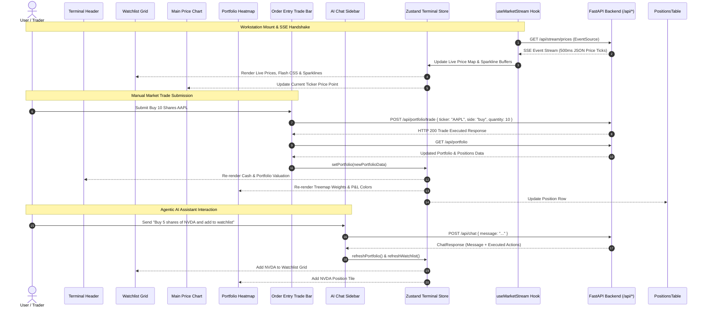

# Phase 4 Research: Next.js Frontend Trading Terminal UI

**Phase:** Phase 4 — Next.js Frontend Trading Terminal UI  
**Requirements Addressed:** UI-01, UI-02, UI-03, UI-04, UI-05, UI-06, UI-07, UI-08, UI-09  
**Target Output File:** `.planning/phases/04-next-js-frontend-trading-terminal-ui/04-RESEARCH.md`  

---

## 1. Summary & Architectural Responsibility Map

### Phase Objectives
Phase 4 constructs the frontend user interface for the FinAlly AI Trading Workstation. The UI is built as a single-page application (SPA) using Next.js 14 (App Router) with TypeScript, styled with Tailwind CSS in a dark Bloomberg terminal aesthetic (`#0d1117` / `#1a1a2e`, yellow `#ecad0a`, blue `#209dd7`, purple `#753991`), and configured for static HTML export (`output: 'export'`) to be served by the FastAPI backend on port 8000.

Key deliverables for Phase 4:
1. **UI-01**: Next.js TypeScript project setup with static export configuration (`output: 'export'`) and Tailwind CSS dark theme design system.
2. **UI-02**: Terminal Header displaying live total portfolio value, connection status dot (green=connected, yellow=reconnecting, red=disconnected), and available cash balance.
3. **UI-03**: Watchlist Grid displaying live prices with green/red flash animations (500ms fade), % change, sparkline mini-charts, and ticker selection.
4. **UI-04**: Interactive Main Price Chart displaying price history over time for the selected ticker.
5. **UI-05**: Portfolio Heatmap (Treemap) visualizing position weights sized by market value and color-coded by unrealized P&L (green profit / red loss).
6. **UI-06**: Portfolio P&L Line Chart displaying total portfolio value history over time.
7. **UI-07**: Positions Table displaying ticker, quantity, avg cost, current price, unrealized P&L, and % change.
8. **UI-08**: Order Entry Trade Bar for instant market buy/sell order submission.
9. **UI-09**: AI Chat Panel sidebar with message history, loading states, and inline trade/watchlist action confirmation cards.

### Architectural Responsibility Map

| Component / Module | Primary Responsibility | Key Props / State / Exports |
|--------------------|------------------------|-----------------------------|
| `frontend/next.config.mjs` | Next.js build configuration enforcing static HTML export | `output: 'export'`, `images: { unoptimized: true }` |
| `frontend/tailwind.config.js` | Tailwind CSS configuration extending terminal color palette | Custom colors: `terminal-bg`, `terminal-card`, `terminal-yellow`, `terminal-blue`, `terminal-purple` |
| `frontend/src/types/index.ts` | TypeScript interface definitions for pricing ticks, portfolio state, positions, trades, watchlist items, and AI chat logs | `PriceTick`, `WatchlistItem`, `Position`, `Portfolio`, `TradeRequest`, `ChatMessage`, `ActionCard` |
| `frontend/src/lib/api.ts` | REST API client wrapping `fetch` calls to FastAPI backend (`/api/*`) | `getPortfolio()`, `executeTrade()`, `getWatchlist()`, `addWatchlist()`, `deleteWatchlist()`, `sendChatMessage()`, `getChatHistory()` |
| `frontend/src/hooks/useMarketStream.ts` | Custom React hook managing browser `EventSource` SSE connection, reconnection status, price tick updates, flash animations, and sparkline buffers | `status`, `prices`, `sparklines`, `priceFlashes` |
| `frontend/src/store/useTerminalStore.ts` | Global Zustand state store coordinating active ticker selection, portfolio state, watchlist items, and chat history | `selectedTicker`, `portfolio`, `watchlist`, `chatHistory`, `selectTicker()`, `refreshPortfolio()` |
| `frontend/src/components/Header.tsx` | Workstation header displaying total portfolio value, cash balance, and live SSE connection status indicator dot | `TerminalHeader` |
| `frontend/src/components/WatchlistGrid.tsx` | Watchlist cards with price flash animation keyframes, percentage changes, mini SVG/Recharts sparklines, and ticker selection handling | `WatchlistGrid` |
| `frontend/src/components/MainPriceChart.tsx` | Recharts Area/Line chart visualizing historical prices for the currently selected ticker | `MainPriceChart` |
| `frontend/src/components/PortfolioHeatmap.tsx` | Recharts Treemap component rendering position boxes sized by weight and colored by unrealized P&L | `PortfolioHeatmap` |
| `frontend/src/components/PortfolioPnLChart.tsx` | Recharts Line chart plotting snapshot value history from `/api/portfolio/history` | `PortfolioPnLChart` |
| `frontend/src/components/PositionsTable.tsx` | Tabular display of open positions with unrealized P&L indicators | `PositionsTable` |
| `frontend/src/components/TradeBar.tsx` | Instant order entry form with ticker, quantity, and market Buy/Sell buttons | `TradeBar` |
| `frontend/src/components/AIChatPanel.tsx` | Docked sidebar displaying AI Copilot conversation history, prompt input form, loading spinner, and action confirmation cards | `AIChatPanel` |

---

## 2. Standard Stack

### Technology Choices & Specifications

```
┌─────────────────────────────────────────────────────────────────────────────┐
│                       Next.js 14 App Router (React 18)                      │
│                           (`output: 'export'`)                              │
└──────────────────────────────────────┬──────────────────────────────────────┘
                                       │
      ┌────────────────────────────────┼────────────────────────────────┐
      │                                │                                │
┌─────▼───────┐                 ┌──────▼──────┐                  ┌──────▼──────┐
│  Recharts   │                 │ Tailwind CSS│                  │   Zustand   │
│  Visuals    │                 │ Dark Theme  │                  │  State Store│
└─────┬───────┘                 └──────┬──────┘                  └──────┬──────┘
      │                                │                                │
      └────────────────────────────────┼────────────────────────────────┘
                                       │
                      ┌────────────────┴────────────────┐
                      │    Custom `useMarketStream`     │
                      │  (Browser Native EventSource)   │
                      └────────────────┬────────────────┘
                                       │
                      ┌────────────────▼────────────────┐
                      │    FastAPI Backend (/api/*)     │
                      └─────────────────────────────────┘
```

1. **Next.js 14 App Router with Static Export (`output: 'export'`)**:
   - Compiles all pages and components into static HTML, JavaScript, and CSS bundles in the `out/` directory.
   - Eliminates the need for a Node.js server runtime in production; static files are served directly by FastAPI.
2. **Tailwind CSS (Dark Bloomberg Aesthetic)**:
   - Customized palette:
     - Workstation Background: `#0d1117` (Dark Slate/Black)
     - Card / Panel Background: `#1a1a2e` (Deep Blue-Gray)
     - Panel Border: `#21262d` (Muted Steel)
     - Accent Yellow: `#ecad0a` (Highlight/Warning text)
     - Blue Primary: `#209dd7` (Primary buttons / active tabs)
     - Purple Secondary: `#753991` (Action / submit buttons)
     - Green Uptick / Profit: `#22c55e` (Flash & profit indicators)
     - Red Downtick / Loss: `#ef4444` (Flash & loss indicators)
3. **Recharts Charting Framework**:
   - `ResponsiveContainer`, `AreaChart`, `LineChart`, `Treemap`, `XAxis`, `YAxis`, `Tooltip`.
   - Used for Main Price Chart, Portfolio Heatmap, P&L Line Chart, and Watchlist Sparklines.
4. **Lucide React Icons**:
   - Clean terminal icons: `Activity`, `TrendingUp`, `TrendingDown`, `DollarSign`, `Bot`, `Send`, `RefreshCw`, `Plus`, `Trash2`, `Wifi`, `WifiOff`, `ChevronRight`.
5. **State Management with Zustand**:
   - Centralized, zero-boilerplate client state store for managing cross-component interactions (ticker selection, instant balance updates, watchlist modifications).

---

## 3. Architecture Patterns & Diagram

### Pattern 1: Static Export Architecture & Single-Page Application (SPA)
When Next.js is configured with `output: 'export'`:
- The App Router generates a static `index.html` file with client-side JavaScript bundles.
- Routing and component rendering occur entirely client-side inside the browser.
- All HTTP request paths in `api.ts` use relative URLs (`/api/portfolio`, `/api/chat`, `/api/stream/prices`), allowing seamless execution under single-origin FastAPI hosting without CORS headers.

### Pattern 2: Live SSE EventSource Subscriber & In-Memory Sparkline Buffer
To handle 500ms real-time market data ticks efficiently:
- The `useMarketStream` hook instantiates a browser `EventSource` targeting `/api/stream/prices`.
- Incoming JSON ticks update an in-memory price map (`Record<string, PriceTick>`).
- Ticks are appended to rolling price history arrays (up to 30 data points per ticker) used by watchlist sparkline mini-charts.
- A 500ms CSS flash state (`priceFlashes: Record<string, 'up' | 'down'>`) is triggered on price change and automatically cleared after 500ms via `setTimeout`.

### Pattern 3: Unidirectional State Hydration & AI Action Synchronization
When a user submits a trade manually via `TradeBar` or automatically via `AIChatPanel`:
1. `api.ts` executes the REST request (`POST /api/portfolio/trade` or `POST /api/chat`).
2. The response returns updated execution results and new portfolio state.
3. The Zustand store updates `portfolio`, `positions`, and `watchlist` state simultaneously.
4. Active components (`PositionsTable`, `PortfolioHeatmap`, `Header`) immediately re-render with fresh values without requiring page refreshes.

### Complete Data Flow Architecture Diagram



---

## 4. Don't Hand-Roll

| Component | Standard Tool | Risk of Hand-Rolling |
|-----------|---------------|──────────────────────|
| **Financial Charting & Treemap** | `recharts` | Hand-rolling custom SVG math for dynamic line graphs, responsive axis calculations, hover tooltips, and treemap packing algorithms introduces complex bugs and degrades rendering performance. |
| **Terminal Icons** | `lucide-react` | Creating custom inline SVG icons increases code clutter and creates visual inconsistency across buttons, status dots, and tables. |
| **State Management** | `zustand` | Hand-rolling state via multi-level React Context or prop-drilling causes cascading full-tree re-renders every 500ms on every price tick, causing UI lag and input field freeze. |
| **SSE Reconnection Logic** | Native `EventSource` API | Writing custom polling wrappers or fetch loops fails to leverage standard browser EventSource auto-reconnection and exponential backoff. |
| **Utility Classes & CSS Variants** | `clsx` + `tailwind-merge` | Concatenating Tailwind class strings manually leads to class collision bugs (e.g. `bg-green-500` overriding `bg-red-500` incorrectly during rapid CSS transitions). |

---

## 5. Common Pitfalls

### Pitfall 1: Next.js Static Export (`output: 'export'`) Compatibility Failures
- **Symptom**: `next build` fails with `Error: Image Optimization using Next.js default loader is not compatible with output: "export"`.
- **Cause**: Standard Next.js server features (Server Components, `next/image` default optimization, server actions, header rewrites) require a Node.js server.
- **Prevention**: Configure `next.config.mjs` strictly for static export:
  ```javascript
  /** @type {import('next').NextConfig} */
  const nextConfig = {
    output: 'export',
    images: { unoptimized: true },
    trailingSlash: true,
  };
  export default nextConfig;
  ```

### Pitfall 2: React 18 StrictMode Duplicate EventSource Connections
- **Symptom**: Double price tick messages, memory leaks, and multiple active SSE connections visible in DevTools Network tab.
- **Cause**: In React 18 development mode, `useEffect` mounts, unmounts, and re-mounts components to test cleanup logic.
- **Prevention**: Ensure the `useEffect` cleanup function explicitly calls `eventSource.close()`:
  ```typescript
  useEffect(() => {
    const es = new EventSource('/api/stream/prices');
    // ... event handlers
    return () => {
      es.close();
    };
  }, []);
  ```

### Pitfall 3: Recharts ResponsiveContainer Rendering 0 Height / Width
- **Symptom**: Main price chart or portfolio treemap fails to render or collapses to 0px height.
- **Cause**: `ResponsiveContainer` evaluates parent node dimensions before CSS layout recalculation completes.
- **Prevention**: Wrap Recharts components in an explicit parent `div` with defined CSS dimensions (e.g. `className="w-full h-[300px] min-h-[300px]"`).

### Pitfall 4: Rapid State Updates (500ms Ticks) Freezing User Inputs
- **Symptom**: Typing into the Trade Bar or AI Chat input stutters or drops keypresses every time a market data tick arrives.
- **Cause**: Storing high-frequency price ticks in top-level page state forces the entire React component tree (including text inputs) to re-render every 500ms.
- **Prevention**: Decouple live stream state into Zustand with fine-grained selectors, or isolate price updates inside specific child components (`WatchlistGrid`, `MainPriceChart`).

### Pitfall 5: CSS Flash Animation Class Persistence
- **Symptom**: Tickers remain stuck with green/red background highlights indefinitely.
- **Cause**: State updates setting flash status are not cleaned up properly when consecutive ticks arrive in short intervals.
- **Prevention**: Track flash timeout IDs in a React `ref` or clear state explicitly using 500ms `setTimeout` timers.

---

## 6. Code Examples

### 6.1 Next.js Configuration (`next.config.mjs`)

```javascript
/** @type {import('next').NextConfig} */
const nextConfig = {
  output: 'export',
  images: {
    unoptimized: true,
  },
  trailingSlash: true,
  reactStrictMode: true,
};

export default nextConfig;
```

### 6.2 Tailwind CSS Configuration (`tailwind.config.js`)

```javascript
/** @type {import('tailwindcss').Config} */
module.exports = {
  content: [
    './src/pages/**/*.{js,ts,jsx,tsx,mdx}',
    './src/components/**/*.{js,ts,jsx,tsx,mdx}',
    './src/app/**/*.{js,ts,jsx,tsx,mdx}',
  ],
  darkMode: 'class',
  theme: {
    extend: {
      colors: {
        terminal: {
          bg: '#0d1117',
          card: '#1a1a2e',
          border: '#21262d',
          yellow: '#ecad0a',
          blue: '#209dd7',
          purple: '#753991',
          green: '#22c55e',
          red: '#ef4444',
          muted: '#8b949e',
        },
      },
      keyframes: {
        flashGreen: {
          '0%': { backgroundColor: 'rgba(34, 197, 94, 0.4)' },
          '100%': { backgroundColor: 'transparent' },
        },
        flashRed: {
          '0%': { backgroundColor: 'rgba(239, 68, 68, 0.4)' },
          '100%': { backgroundColor: 'transparent' },
        },
      },
      animation: {
        'flash-green': 'flashGreen 0.5s ease-out',
        'flash-red': 'flashRed 0.5s ease-out',
      },
    },
  },
  plugins: [],
};
```

### 6.3 TypeScript Interfaces (`src/types/index.ts`)

```typescript
export interface PriceTick {
  ticker: string;
  price: number;
  previous_price: number;
  change: number;
  direction: 'up' | 'down' | 'flat';
  timestamp: string;
}

export interface Position {
  ticker: string;
  quantity: number;
  avg_cost: number;
  current_price: number;
  market_value: number;
  unrealized_pnl: number;
  unrealized_pnl_percent: number;
}

export interface Portfolio {
  cash_balance: number;
  positions_value: number;
  total_value: number;
  total_unrealized_pnl: number;
  total_unrealized_pnl_percent: number;
  positions: Position[];
}

export interface PortfolioSnapshot {
  id: string;
  total_value: number;
  recorded_at: string;
}

export interface WatchlistItem {
  id: string;
  ticker: string;
  price: number;
  previous_price: number;
  change: number;
  direction: 'up' | 'down' | 'flat';
  added_at: string;
}

export interface TradeRequest {
  ticker: string;
  side: 'buy' | 'sell';
  quantity: number;
}

export interface ExecutedAction {
  trades?: Array<{
    ticker: string;
    side: 'buy' | 'sell';
    quantity: number;
    price: number;
    status: 'success' | 'failed';
    error?: string;
  }>;
  watchlist_changes?: Array<{
    ticker: string;
    action: 'add' | 'remove';
    status: 'success' | 'failed';
    error?: string;
  }>;
}

export interface ChatMessage {
  id: string;
  role: 'user' | 'assistant';
  content: string;
  actions?: ExecutedAction | null;
  created_at: string;
}
```

### 6.4 Custom SSE Market Stream Hook (`src/hooks/useMarketStream.ts`)

```typescript
import { useState, useEffect, useRef } from 'react';
import { PriceTick } from '@/types';

export type StreamStatus = 'connected' | 'reconnecting' | 'disconnected';

export interface UseMarketStreamReturn {
  status: StreamStatus;
  prices: Record<string, PriceTick>;
  sparklines: Record<string, number[]>;
  flashes: Record<string, 'up' | 'down' | null>;
}

export function useMarketStream(streamUrl: string = '/api/stream/prices'): UseMarketStreamReturn {
  const [status, setStatus] = useState<StreamStatus>('disconnected');
  const [prices, setPrices] = useState<Record<string, PriceTick>>({});
  const [sparklines, setSparklines] = useState<Record<string, number[]>>({});
  const [flashes, setFlashes] = useState<Record<string, 'up' | 'down' | null>>({});
  
  const flashTimeouts = useRef<Record<string, NodeJS.Timeout>>({});

  useEffect(() => {
    setStatus('reconnecting');
    const eventSource = new EventSource(streamUrl);

    eventSource.onopen = () => {
      setStatus('connected');
    };

    eventSource.onmessage = (event) => {
      try {
        const tick: PriceTick = JSON.parse(event.data);
        const { ticker, price, direction } = tick;

        // 1. Update prices map
        setPrices((prev) => ({ ...prev, [ticker]: tick }));

        // 2. Append to rolling sparkline array (keep last 30 ticks)
        setSparklines((prev) => {
          const currentHistory = prev[ticker] || [];
          const updatedHistory = [...currentHistory, price].slice(-30);
          return { ...prev, [ticker]: updatedHistory };
        });

        // 3. Trigger 500ms flash animation if price changed
        if (direction === 'up' || direction === 'down') {
          setFlashes((prev) => ({ ...prev, [ticker]: direction }));
          
          if (flashTimeouts.current[ticker]) {
            clearTimeout(flashTimeouts.current[ticker]);
          }
          
          flashTimeouts.current[ticker] = setTimeout(() => {
            setFlashes((prev) => ({ ...prev, [ticker]: null }));
          }, 500);
        }
      } catch (err) {
        console.error('Failed to parse SSE price tick:', err);
      }
    };

    eventSource.onerror = () => {
      setStatus('reconnecting');
    };

    return () => {
      eventSource.close();
      setStatus('disconnected');
      Object.values(flashTimeouts.current).forEach(clearTimeout);
    };
  }, [streamUrl]);

  return { status, prices, sparklines, flashes };
}
```

### 6.5 Global Terminal State Store (`src/store/useTerminalStore.ts`)

```typescript
import { create } from 'zustand';
import { Portfolio, WatchlistItem, ChatMessage, PortfolioSnapshot } from '@/types';
import * as api from '@/lib/api';

interface TerminalStore {
  selectedTicker: string;
  portfolio: Portfolio | null;
  watchlist: WatchlistItem[];
  history: PortfolioSnapshot[];
  chatHistory: ChatMessage[];
  isLoadingChat: boolean;
  
  setSelectedTicker: (ticker: string) => void;
  fetchPortfolio: () => Promise<void>;
  fetchWatchlist: () => Promise<void>;
  fetchHistory: () => Promise<void>;
  fetchChatHistory: () => Promise<void>;
  sendChatMessage: (message: string) => Promise<void>;
  executeTrade: (ticker: string, side: 'buy' | 'sell', quantity: number) => Promise<void>;
  addWatchlistTicker: (ticker: string) => Promise<void>;
  removeWatchlistTicker: (ticker: string) => Promise<void>;
}

export const useTerminalStore = create<TerminalStore>((set, get) => ({
  selectedTicker: 'AAPL',
  portfolio: null,
  watchlist: [],
  history: [],
  chatHistory: [],
  isLoadingChat: false,

  setSelectedTicker: (ticker: string) => set({ selectedTicker: ticker.toUpperCase() }),

  fetchPortfolio: async () => {
    try {
      const portfolio = await api.getPortfolio();
      set({ portfolio });
    } catch (err) {
      console.error('Error fetching portfolio:', err);
    }
  },

  fetchWatchlist: async () => {
    try {
      const watchlist = await api.getWatchlist();
      set({ watchlist });
    } catch (err) {
      console.error('Error fetching watchlist:', err);
    }
  },

  fetchHistory: async () => {
    try {
      const history = await api.getPortfolioHistory();
      set({ history });
    } catch (err) {
      console.error('Error fetching history:', err);
    }
  },

  fetchChatHistory: async () => {
    try {
      const chatHistory = await api.getChatHistory();
      set({ chatHistory });
    } catch (err) {
      console.error('Error fetching chat history:', err);
    }
  },

  sendChatMessage: async (message: string) => {
    set({ isLoadingChat: true });
    try {
      await api.sendChatMessage(message);
      await Promise.all([get().fetchChatHistory(), get().fetchPortfolio(), get().fetchWatchlist()]);
    } catch (err) {
      console.error('Error sending chat message:', err);
    } finally {
      set({ isLoadingChat: false });
    }
  },

  executeTrade: async (ticker: string, side: 'buy' | 'sell', quantity: number) => {
    try {
      await api.executeTrade({ ticker, side, quantity });
      await Promise.all([get().fetchPortfolio(), get().fetchHistory()]);
    } catch (err) {
      console.error('Error executing trade:', err);
      throw err;
    }
  },

  addWatchlistTicker: async (ticker: string) => {
    try {
      await api.addWatchlist(ticker);
      await get().fetchWatchlist();
    } catch (err) {
      console.error('Error adding watchlist ticker:', err);
    }
  },

  removeWatchlistTicker: async (ticker: string) => {
    try {
      await api.deleteWatchlist(ticker);
      await get().fetchWatchlist();
    } catch (err) {
      console.error('Error removing watchlist ticker:', err);
    }
  },
}));
```

### 6.6 Header Component (`src/components/Header.tsx`)

```tsx
'use client';

import React from 'react';
import { StreamStatus } from '@/hooks/useMarketStream';
import { Portfolio } from '@/types';
import { Activity, DollarSign, Wallet } from 'lucide-react';

interface HeaderProps {
  status: StreamStatus;
  portfolio: Portfolio | null;
}

export const TerminalHeader: React.FC<HeaderProps> = ({ status, portfolio }) => {
  const getStatusColor = () => {
    switch (status) {
      case 'connected': return 'bg-emerald-500 shadow-[0_0_8px_rgba(16,185,129,0.8)]';
      case 'reconnecting': return 'bg-yellow-500 animate-pulse';
      case 'disconnected': return 'bg-red-500';
    }
  };

  return (
    <header className="h-14 border-b border-terminal-border bg-terminal-card/80 backdrop-blur px-4 flex items-center justify-between">
      <div className="flex items-center space-x-3">
        <Activity className="w-5 h-5 text-terminal-yellow" />
        <span className="font-bold tracking-wider text-white text-lg">FinAlly</span>
        <span className="text-xs px-2 py-0.5 rounded bg-terminal-purple/30 text-purple-300 font-mono">TERMINAL v1.0</span>
      </div>

      <div className="flex items-center space-x-6">
        {/* Total Value */}
        <div className="flex items-center space-x-2">
          <DollarSign className="w-4 h-4 text-terminal-blue" />
          <span className="text-xs text-terminal-muted uppercase">Portfolio Value:</span>
          <span className="font-mono text-sm font-semibold text-white">
            ${portfolio ? portfolio.total_value.toLocaleString(undefined, { minimumFractionDigits: 2, maximumFractionDigits: 2 }) : '10,000.00'}
          </span>
        </div>

        {/* Cash Balance */}
        <div className="flex items-center space-x-2">
          <Wallet className="w-4 h-4 text-terminal-yellow" />
          <span className="text-xs text-terminal-muted uppercase">Cash:</span>
          <span className="font-mono text-sm font-semibold text-white">
            ${portfolio ? portfolio.cash_balance.toLocaleString(undefined, { minimumFractionDigits: 2, maximumFractionDigits: 2 }) : '10,000.00'}
          </span>
        </div>

        {/* Connection Status Dot */}
        <div className="flex items-center space-x-2 bg-terminal-bg/50 px-2.5 py-1 rounded border border-terminal-border">
          <span className={`w-2.5 h-2.5 rounded-full ${getStatusColor()}`} />
          <span className="text-xs font-mono uppercase text-terminal-muted">{status}</span>
        </div>
      </div>
    </header>
  );
};
```

---

## 7. Validation Architecture

### Automated Verification Strategy

Phase 4 user interface components and end-to-end user workflows will be verified through:
1. **Component Integration Verification**: Building the static Next.js project via `npm run build` inside `frontend/` to confirm strict TypeScript compilation and `output: 'export'` static output generation without errors.
2. **Playwright E2E Test Suite**: Integration tests defined under `test/e2e/terminal.spec.ts` executing against the live FastAPI server hosting the exported frontend.

```
frontend/
├── src/
│   ├── app/
│   │   ├── page.tsx          # Terminal Layout Root Page
│   │   └── layout.tsx        # App Shell Layout
│   ├── components/
│   │   ├── Header.tsx        # UI-02 Header
│   │   ├── WatchlistGrid.tsx # UI-03 Watchlist & Sparklines
│   │   ├── MainPriceChart.tsx# UI-04 Interactive Price Chart
│   │   ├── PortfolioHeatmap.tsx # UI-05 Treemap Heatmap
│   │   ├── PortfolioPnLChart.tsx# UI-06 Portfolio P&L Chart
│   │   ├── PositionsTable.tsx# UI-07 Positions Table
│   │   ├── TradeBar.tsx      # UI-08 Order Entry Form
│   │   └── AIChatPanel.tsx   # UI-09 AI Copilot Sidebar
│   ├── hooks/
│   │   └── useMarketStream.ts# Market Data SSE Subscriber Hook
│   ├── store/
│   │   └── useTerminalStore.ts # Centralized Zustand Store
│   └── lib/
│       └── api.ts            # REST Client Wrapper
└── out/                      # Built Static Export Bundle
```

### Key Build & Test Commands

```bash
# 1. Test Next.js Static Export Build
cd frontend
npm install
npm run build   # Produces static files in out/

# 2. Run Playwright E2E Terminal Tests
cd ../test
npm test
```

### Requirement-to-Test Mapping

| Requirement | Target Component / File | Verification Method / Assertions |
|-------------|-------------------------|──────────────────────────────────|
| **UI-01** | `frontend/next.config.mjs`, `tailwind.config.js` | Build step produces valid `out/` directory; dark theme colors resolve in DOM styles. |
| **UI-02** | `Header.tsx` | Asserts portfolio value, cash balance, and connection dot (`.bg-emerald-500`) render in header bar. |
| **UI-03** | `WatchlistGrid.tsx`, `useMarketStream.ts` | Asserts 10 default tickers appear in grid; price updates trigger flash CSS classes (`.animate-flash-green` / `.animate-flash-red`); sparkline mini-charts render. |
| **UI-04** | `MainPriceChart.tsx` | Clicking ticker in watchlist selects it and updates the main chart title & price history timeline. |
| **UI-05** | `PortfolioHeatmap.tsx` | Asserts Recharts Treemap renders position blocks sized by market weight and colored green (profit) or red (loss). |
| **UI-06** | `PortfolioPnLChart.tsx` | Asserts line chart plots portfolio snapshot history over time. |
| **UI-07** | `PositionsTable.tsx` | Asserts position table lists ticker, quantity, avg cost, current price, and unrealized P&L. |
| **UI-08** | `TradeBar.tsx` | Submitting buy/sell order dispatches `POST /api/portfolio/trade` and updates balance immediately. |
| **UI-09** | `AIChatPanel.tsx` | Submitting prompt renders user message, loading indicator, assistant text, and inline trade/watchlist confirmation cards. |

---

## 8. Security Domain

1. **Static Export Origin Security**:
   - Compiling Next.js with `output: 'export'` eliminates server-side secrets from client-side bundles. All sensitive configurations (`OPENROUTER_API_KEY`) remain strictly on the FastAPI backend.
2. **Client-Side Input Sanitization**:
   - User inputs in `TradeBar` (ticker symbol, quantity) and `AIChatPanel` (prompt text) are sanitized before dispatch to prevent malformed API requests or XSS attacks.
3. **Graceful Connection Failure Recovery**:
   - The SSE `EventSource` connection gracefully handles network drops or backend reboots, falling back to a `reconnecting` indicator dot without freezing the UI or throwing unhandled React runtime crashes.
