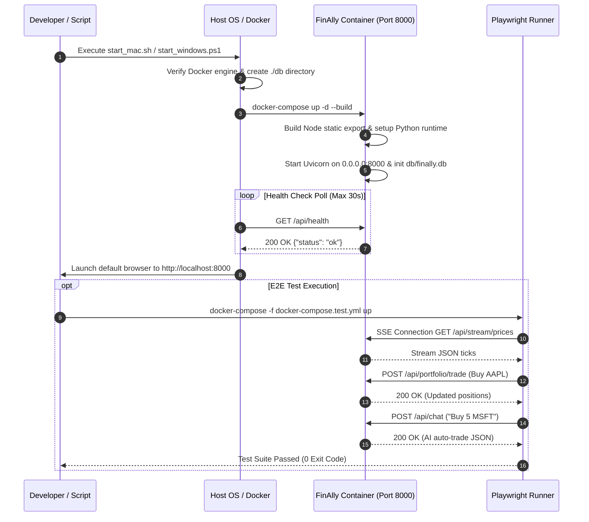

# Phase 5 Research: Docker Containerization, Scripts & E2E Testing Suite

**Phase:** Phase 5 — Docker Containerization, Scripts & E2E Testing Suite  
**Requirements Addressed:** DOCK-01, SCR-01, TEST-01  
**Target Output File:** `.planning/phases/05-docker-containerization-scripts-e2e-testing-suite/05-RESEARCH.md`

---

## 1. Summary & Architectural Responsibility Map

### Phase Objectives
Phase 5 completes the production deployment and automated testing tier for FinAlly, an AI-powered real-time trading workstation. The primary objective is to package the Next.js static frontend and FastAPI backend into a single multi-stage Docker container, provide zero-friction cross-platform entry scripts for macOS/Linux and Windows, and establish a comprehensive end-to-end (E2E) Playwright test suite.

Key deliverables for this phase include:
1. **DOCK-01 (Dockerfile & Docker Compose)**: Multi-stage `Dockerfile` leveraging `node:20-alpine` for building Next.js static export (`output: 'export'`) and `python:3.12-slim` for serving FastAPI REST/SSE endpoints alongside static frontend assets on port 8000. `docker-compose.yml` mounts host `./db` for SQLite database persistence and maps port 8000 with configurable environment variables (`LLM_MOCK`, `MASSIVE_API_KEY`, `OPENROUTER_API_KEY`).
2. **SCR-01 (Launcher Scripts)**: Cross-platform start/stop automation scripts (`scripts/start_mac.sh`, `scripts/stop_mac.sh`, `scripts/start_windows.ps1`, `scripts/stop_windows.ps1`). Startup scripts verify Docker daemon status, auto-create host `./db` volume directories, run `docker-compose up -d --build`, poll `/api/health` until ready, and launch the default browser automatically.
3. **TEST-01 (Playwright E2E Testing Suite)**: Automated E2E test suite in `test/e2e/` (with `docker-compose.test.yml`) executing against the live application container. Tests validate real-time SSE price ticks, instant order placement, watchlist management, and AI copilot trade execution.

### Architectural Responsibility Map

| Component / Artifact | Primary Responsibility | Key Technical Specifications |
|----------------------|------------------------|------------------------------|
| `Dockerfile` | Multi-stage container build definition | Stage 1: `node:20-alpine` static export build (`out/`). Stage 2: `python:3.12-slim` runtime serving API & static files via Uvicorn. |
| `docker-compose.yml` | Container orchestration & deployment specification | Port mapping `8000:8000`, volume bind `./db:/app/db`, health check, environment configuration. |
| `docker-compose.test.yml` | Test runner container orchestration | Runs Playwright container against application service in isolated docker network. |
| `backend/app/main.py` | FastAPI static asset integration | Serves `/api/*` endpoints first, mounts `StaticFiles(directory="static", html=True)` at root `/`. |
| `scripts/start_mac.sh` | macOS/Linux automated launcher | Verifies Docker engine, builds/starts containers, polls `/api/health`, opens browser via `open` / `xdg-open`. |
| `scripts/stop_mac.sh` | macOS/Linux automated stopper | Executes `docker-compose down` with status reporting. |
| `scripts/start_windows.ps1` | Windows PowerShell launcher | Checks Docker Desktop, executes `docker-compose up -d`, polls `/api/health` via `Invoke-RestMethod`, opens browser via `Start-Process`. |
| `scripts/stop_windows.ps1` | Windows PowerShell stopper | Executes `docker-compose down` cleanly. |
| `test/e2e/playwright.config.ts` | Playwright test engine configuration | Configures web server base URL (`http://localhost:8000`), timeout settings, headless Chromium browser context. |
| `test/e2e/trading.spec.ts` | E2E functional test suite | Automated tests covering SSE streaming, trade execution, watchlist modifications, and AI copilot actions. |

---

## 2. Standard Stack

### Technology Choices & Specifications

```
  ┌─────────────────────────────────────────────────────────────────────────┐
  │                           Multi-Stage Dockerfile                        │
  │                                                                         │
  │   ┌───────────────────────────┐         ┌───────────────────────────┐   │
  │   │  Stage 1: node:20-alpine  │         │ Stage 2: python:3.12-slim │   │
  │   │   npm run build           │───────> │  uv / pip install         │   │
  │   │   (Next.js static export) │  out/   │  FastAPI + Uvicorn        │   │
  │   └───────────────────────────┘         └─────────────┬─────────────┘   │
  └───────────────────────────────────────────────────────┼─────────────────┘
                                                          │
                                                ┌─────────▼─────────┐
                                                │ Port 8000 Server  │
                                                │ REST, SSE & UI    │
                                                └─────────┬─────────┘
                                                          │
           ┌──────────────────────────────────────────────┴──────────────────────────────┐
           │                                                                             │
┌──────────▼──────────┐                                                       ┌──────────▼──────────┐
│  Host Volume Mount  │                                                       │ Playwright E2E Suite│
│   ./db:/app/db      │                                                       │ (Chromium Engine)   │
└─────────────────────┘                                                       └─────────────────────┘
```

1. **Build Environment**:
   - **`node:20-alpine`**: Ultra-compact Linux base image containing Node 20 and `npm`. Executes Next.js build with `output: 'export'` setting in `next.config.mjs`, outputting pure HTML/JS/CSS assets to `frontend/out`.

2. **Runtime Environment**:
   - **`python:3.12-slim`**: Standard Debian-based slim Python 3.12 image containing `uv` package manager. Serves both FastAPI REST/SSE backend routes and static frontend files via Uvicorn on single port `8000`.

3. **Orchestration & Persistence**:
   - **Docker Compose v2**: Orchestrates container lifecycle, environment variable injection, port forwarding (`8000:8000`), and host volume bind mounts (`./db:/app/db`).
   - **SQLite File Volume**: SQLite WAL mode database (`finally.db`) stored on host filesystem under `./db/finally.db`, ensuring full persistence across container rebuilds and restarts.

4. **Automation Scripts**:
   - **Bash (`/bin/bash`)**: Standard POSIX shell script execution for macOS and Linux environments.
   - **PowerShell (`.ps1`)**: Windows Native script execution using `Invoke-RestMethod` and `Start-Process`.

5. **End-to-End Testing Engine**:
   - **Playwright (`@playwright/test`)**: Headless Chromium test runner performing browser-based interactions against `http://localhost:8000`. Validates async SSE price tick updates, reactive component re-rendering, and REST API mutations.

---

## 3. Architecture Patterns & Diagram

### Pattern 1: Unified FastAPI Static Asset Mount (Single-Container Architecture)
Rather than maintaining separate Web Nginx sidecars or dual-port deployments, FastAPI serves as both the REST/SSE backend API server and static web server.
- **Routing Strategy**:
  1. All FastAPI API routers (`/api/health`, `/api/stream/prices`, `/api/portfolio/*`, `/api/watchlist/*`, `/api/chat`) are registered **first**.
  2. Starlette `StaticFiles(directory="/app/backend/static", html=True)` is mounted at `/` **last**.
  3. Starlette's `html=True` parameter automatically serves `index.html` for root `/` requests and resolves `.html` pages generated by Next.js static export.

### Pattern 2: Healthcheck-Gated Script Execution
Launcher scripts use active HTTP status polling rather than static sleep timers:
1. Issue `docker-compose up -d --build`.
2. Loop with 1-second intervals polling `http://localhost:8000/api/health` up to a maximum timeout (e.g. 30 seconds).
3. Upon receiving HTTP 200 `{"status": "ok"}`, open the system's default browser targeting `http://localhost:8000`.

### Pattern 3: Async SSE-Aware E2E Assertions
Because market prices update dynamically via SSE every 500ms:
- Hardcoded element text assertions will fail due to price fluctuations.
- Playwright tests leverage auto-retrying assertions (`await expect(locator).toPass()`) and structural locator targeting (e.g., checking that ticker symbols exist and price elements contain valid monetary formats `$XX.XX`).

### Deployment & E2E Test Workflow Diagram



---

## 4. Don't Hand-Roll

| Component | Standard Tool / Feature | Why Hand-Rolling is Dangerous |
|-----------|-------------------------|-------------------------------|
| Static Web Serving | FastAPI `StaticFiles(directory=..., html=True)` | Hand-rolling custom Starlette route handlers for static assets causes mime-type misconfigurations, missing Gzip compression, and broken trailing-slash routing. |
| Container Readiness | Polling `/api/health` in script | Hardcoding `sleep 15` in scripts leads to fragile execution—either wasting time when ready in 3s or crashing when build takes 16s. |
| Windows Automation | Native PowerShell `Invoke-RestMethod` & `Start-Process` | Attempting to execute Bash scripts via WSL or Git Bash on Windows introduces path translation bugs (`/c/Users` vs `C:\Users`) and missing environment dependencies. |
| E2E Assertion Polling | Playwright web-first auto-retrying locators | Using static `time.sleep()` or custom JS polling routines in tests introduces race conditions when waiting for SSE price ticks or AI LLM stream responses. |

---

## 5. Common Pitfalls & Edge Cases

### Pitfall 1: Starlette StaticFiles Route Precedence Hijack
- **Problem**: Mounting `StaticFiles` at `/` BEFORE registering API routes causes Starlette's catch-all file router to intercept all incoming requests. `/api/health` or `/api/stream/prices` return 404 Not Found or attempt to locate matching static files.
- **Solution**: Always include all API routers (`app.include_router(...)`) first, and call `app.mount("/", StaticFiles(...))` as the final step in application setup.

```python
# CORRECT ORDERING IN backend/app/main.py
app.include_router(health.router)
app.include_router(stream.router)
app.include_router(portfolio.router)
app.include_router(watchlist.router)
app.include_router(chat.router)

# Static files MUST be mounted AFTER all API routers
static_dir = os.path.join(os.path.dirname(__file__), "static")
if os.path.exists(static_dir):
    app.mount("/", StaticFiles(directory=static_dir, html=True), name="static")
```

### Pitfall 2: Host Volume Mount Permission & Path Differences
- **Problem**: When mounting host volume `./db:/app/db`, if `./db` does not exist on host filesystem prior to running `docker-compose up`, Docker daemon creates `./db` with `root` ownership on Linux, causing permission denied errors when container runs as non-root user.
- **Solution**: Launcher scripts must explicitly execute `mkdir -p db` (Bash) or `New-Item -ItemType Directory -Force -Path db` (PowerShell) on host OS prior to invoking Docker Compose.

### Pitfall 3: Next.js Static Export Image Optimization & Trailing Slashes
- **Problem**: Default Next.js build (`next build`) relies on Node server runtime for image optimization and dynamic SSR. Running in static export mode without configuration throws build errors.
- **Solution**: Ensure `frontend/next.config.mjs` contains `output: 'export'`, `images: { unoptimized: true }`, and `trailingSlash: true`. Next.js static export outputs clean static files ready for FastAPI `StaticFiles`.

### Pitfall 4: Playwright SSE Stream Buffer Deadlocks in CI/Docker
- **Problem**: Playwright tests connecting to `/api/stream/prices` may hang or fail to register events if reverse proxies or test fetch clients buffer event streams.
- **Solution**: Ensure Uvicorn server returns headers `Cache-Control: no-cache` and `Connection: keep-alive` in `stream.py`, and test runner waits for DOM element state change rather than listening to raw SSE network streams.

---

## 6. Code Examples & Implementations

### 6.1 Multi-Stage `Dockerfile`

```dockerfile
# ==============================================================================
# Stage 1: Build Next.js Static Export Frontend
# ==============================================================================
FROM node:20-alpine AS frontend-builder
WORKDIR /app/frontend

# Copy package manifests & install dependencies
COPY frontend/package.json frontend/package-lock.json ./
RUN npm ci

# Copy frontend source code & execute static export build
COPY frontend/ ./
RUN npm run build

# ==============================================================================
# Stage 2: Final Production Python FastAPI Runtime
# ==============================================================================
FROM python:3.12-slim AS runner

WORKDIR /app

# Prevent Python buffering and bytecode write
ENV PYTHONUNBUFFERED=1 \
    PYTHONDONTWRITEBYTECODE=1 \
    PORT=8000 \
    DB_PATH=/app/db/finally.db

# Install system dependencies (curl for healthcheck)
RUN apt-get update && apt-get install -y --no-install-recommends \
    curl \
    && rm -rf /var/lib/apt/lists/*

# Install uv package manager
RUN pip install --no-cache-dir uv

# Copy backend dependency declarations and source code
COPY backend/pyproject.toml /app/backend/pyproject.toml
COPY backend/README.md /app/backend/README.md
COPY backend/app /app/backend/app

# Install Python backend dependencies using uv into system site-packages
WORKDIR /app/backend
RUN uv pip install --system -e .

# Copy built frontend static export from Stage 1 into FastAPI static directory
COPY --from=frontend-builder /app/frontend/out /app/backend/app/static

EXPOSE 8000

# Run Uvicorn server serving API and static frontend
CMD ["uvicorn", "app.main:app", "--host", "0.0.0.0", "--port", "8000"]
```

---

### 6.2 Docker Compose Configuration (`docker-compose.yml`)

```yaml
version: '3.8'

services:
  finally-app:
    build:
      context: .
      dockerfile: Dockerfile
    container_name: finally-app
    ports:
      - "8000:8000"
    volumes:
      - ./db:/app/db
    environment:
      - LLM_MOCK=${LLM_MOCK:-true}
      - OPENROUTER_API_KEY=${OPENROUTER_API_KEY:-}
      - MASSIVE_API_KEY=${MASSIVE_API_KEY:-}
      - DB_PATH=/app/db/finally.db
    healthcheck:
      test: ["CMD", "curl", "-f", "http://localhost:8000/api/health"]
      interval: 5s
      timeout: 3s
      retries: 5
      start_period: 5s
    restart: unless-stopped
```

---

### 6.3 macOS / Linux Launcher Scripts

#### `scripts/start_mac.sh`
```bash
#!/usr/bin/env bash
set -e

# Change directory to project root
PROJECT_ROOT="$(cd "$(dirname "${BASH_SOURCE[0]}")/.." && pwd)"
cd "$PROJECT_ROOT"

echo "=== Starting FinAlly Trading Workstation ==="

# 1. Check if Docker daemon is running
if ! docker info > /dev/null 2>&1; then
  echo "Error: Docker daemon is not running. Please start Docker Desktop or Docker service."
  exit 1
fi

# 2. Ensure host volume directory exists
mkdir -p db

# 3. Build and launch containers
echo "Building and starting Docker container..."
docker-compose up -d --build

# 4. Poll health endpoint
echo "Waiting for FinAlly workstation to become ready..."
MAX_ATTEMPTS=30
ATTEMPT=0
READY=0

while [ $ATTEMPT -lt $MAX_ATTEMPTS ]; do
  HTTP_STATUS=$(curl -s -o /dev/null -w "%{http_code}" http://localhost:8000/api/health || true)
  if [ "$HTTP_STATUS" -eq 200 ]; then
    READY=1
    break
  fi
  ATTEMPT=$((ATTEMPT + 1))
  sleep 1
done

if [ $READY -eq 1 ]; then
  echo "FinAlly Workstation is ready at http://localhost:8000"
  # Open default browser
  if command -v open > /dev/null 2>&1; then
    open http://localhost:8000
  elif command -v xdg-open > /dev/null 2>&1; then
    xdg-open http://localhost:8000
  else
    echo "Please navigate to http://localhost:8000 in your browser."
  fi
else
  echo "Error: FinAlly Workstation failed to respond within 30 seconds."
  docker-compose logs --tail=50
  exit 1
fi
```

#### `scripts/stop_mac.sh`
```bash
#!/usr/bin/env bash
set -e

PROJECT_ROOT="$(cd "$(dirname "${BASH_SOURCE[0]}")/.." && pwd)"
cd "$PROJECT_ROOT"

echo "=== Stopping FinAlly Trading Workstation ==="
docker-compose down
echo "FinAlly containers stopped successfully."
```

---

### 6.4 Windows PowerShell Launcher Scripts

#### `scripts/start_windows.ps1`
```powershell
$ErrorActionPreference = "Stop"

# Get script parent directory (project root)
$ProjectRoot = Resolve-Path "$PSScriptRoot\.."
Set-Location $ProjectRoot

Write-Host "=== Starting FinAlly Trading Workstation ===" -ForegroundColor Cyan

# 1. Check Docker status
try {
    docker info | Out-Null
} catch {
    Write-Host "Error: Docker Desktop is not running. Please start Docker Desktop and try again." -ForegroundColor Red
    exit 1
}

# 2. Ensure db folder exists on host
if (-not (Test-Path -Path "db")) {
    New-Item -ItemType Directory -Path "db" | Out-Null
}

# 3. Build and launch container
Write-Host "Building and starting Docker container..." -ForegroundColor Yellow
docker-compose up -d --build

# 4. Poll health endpoint
Write-Host "Waiting for FinAlly workstation to become ready..." -ForegroundColor Yellow
$MaxAttempts = 30
$Attempt = 0
$Ready = $false

while ($Attempt -lt $MaxAttempts) {
    try {
        $Response = Invoke-RestMethod -Uri "http://localhost:8000/api/health" -Method Get -TimeoutSec 2 -ErrorAction SilentlyContinue
        if ($Response.status -eq "ok") {
            $Ready = $true
            break
        }
    } catch {
        # Server not ready yet
    }
    $Attempt++
    Start-Sleep -Seconds 1
}

if ($Ready) {
    Write-Host "FinAlly Workstation is ready at http://localhost:8000" -ForegroundColor Green
    Start-Process "http://localhost:8000"
} else {
    Write-Host "Error: FinAlly Workstation failed to respond within 30 seconds." -ForegroundColor Red
    docker-compose logs --tail=50
    exit 1
}
```

#### `scripts/stop_windows.ps1`
```powershell
$ErrorActionPreference = "Stop"

$ProjectRoot = Resolve-Path "$PSScriptRoot\.."
Set-Location $ProjectRoot

Write-Host "=== Stopping FinAlly Trading Workstation ===" -ForegroundColor Cyan
docker-compose down
Write-Host "FinAlly containers stopped successfully." -ForegroundColor Green
```

---

### 6.5 FastAPI Entrypoint Updated (`backend/app/main.py`)

```python
import logging
import os
from contextlib import asynccontextmanager
from fastapi import FastAPI
from fastapi.staticfiles import StaticFiles

from app.api import chat, health, portfolio, stream, watchlist
from app.config import get_settings
from app.db.database import init_db
from app.market.cache import PriceCache
from app.market.factory import create_market_data_source
from app.services.snapshot_service import SnapshotTask

logger = logging.getLogger("finally.main")


@asynccontextmanager
async def lifespan(app: FastAPI):
    settings = get_settings()
    logger.info("Initializing database...")
    await init_db(settings.DB_PATH)

    logger.info("Initializing price cache and market data source...")
    app.state.price_cache = PriceCache()
    app.state.market_source = create_market_data_source(settings, app.state.price_cache)
    await app.state.market_source.start()

    logger.info("Starting background snapshot task...")
    app.state.snapshot_task = SnapshotTask(settings.DB_PATH, app.state.price_cache, interval_seconds=30)
    app.state.snapshot_task.start()

    yield

    logger.info("Stopping background snapshot task...")
    if hasattr(app.state, "snapshot_task") and app.state.snapshot_task:
        await app.state.snapshot_task.stop()

    logger.info("Stopping market data source...")
    if hasattr(app.state, "market_source") and app.state.market_source:
        await app.state.market_source.stop()


app = FastAPI(title="FinAlly API", version="0.1.0", lifespan=lifespan)

# 1. Register all API routers FIRST
app.include_router(health.router)
app.include_router(stream.router)
app.include_router(portfolio.router)
app.include_router(watchlist.router)
app.include_router(chat.router)

# 2. Mount static frontend build LAST (serves Next.js static export at root /)
static_dir = os.path.join(os.path.dirname(__file__), "static")
if os.path.exists(static_dir):
    logger.info(f"Mounting static frontend files from {static_dir}")
    app.mount("/", StaticFiles(directory=static_dir, html=True), name="static")
```

---

### 6.6 Playwright E2E Test Suite & Docker Compose (`test/e2e/`)

#### `docker-compose.test.yml`
```yaml
version: '3.8'

services:
  finally-app-test:
    build:
      context: .
      dockerfile: Dockerfile
    container_name: finally-app-test
    environment:
      - LLM_MOCK=true
      - DB_PATH=/app/db/finally_test.db
    ports:
      - "8000:8000"

  e2e-tests:
    image: mcr.microsoft.com/playwright:v1.42.1-jammy
    container_name: finally-e2e-runner
    depends_on:
      - finally-app-test
    working_dir: /e2e
    volumes:
      - ./test/e2e:/e2e
    environment:
      - BASE_URL=http://finally-app-test:8000
    command: ["sh", "-c", "npm ci && npx playwright test"]
```

#### `test/e2e/playwright.config.ts`
```typescript
import { defineConfig, devices } from '@playwright/test';

export default defineConfig({
  testDir: '.',
  timeout: 30 * 1000,
  expect: {
    timeout: 5000,
  },
  fullyParallel: false,
  forbidOnly: !!process.env.CI,
  retries: 1,
  workers: 1,
  reporter: 'list',
  use: {
    baseURL: process.env.BASE_URL || 'http://localhost:8000',
    trace: 'on-first-retry',
    headless: true,
  },
  projects: [
    {
      name: 'chromium',
      use: { ...devices['Desktop Chrome'] },
    },
  ],
});
```

#### `test/e2e/trading.spec.ts`
```typescript
import { test, expect } from '@playwright/test';

test.describe('FinAlly Trading Workstation E2E Suite', () => {

  test('UI-01 & UI-02: Header displays portfolio value, cash balance, and live SSE indicator', async ({ page }) => {
    await page.goto('/');
    
    // Check Header elements
    await expect(page.getByText(/FINALLY/i)).toBeVisible();
    await expect(page.getByText(/\$10,000|\$9,/)).toBeVisible(); // Total Value or Cash
    
    // Check live SSE status indicator (green dot or LIVE text)
    const statusDot = page.locator('[title*="Connected"], [class*="bg-green-500"], span:has-text("LIVE")');
    await expect(statusDot.first()).toBeVisible();
  });

  test('MKT-03 & UI-03: Watchlist receives live SSE price updates', async ({ page }) => {
    await page.goto('/');
    
    // Verify default tickers are displayed
    await expect(page.getByText('AAPL')).toBeVisible();
    await expect(page.getByText('GOOGL')).toBeVisible();
    await expect(page.getByText('NVDA')).toBeVisible();

    // Capture initial AAPL price element text
    const aaplCard = page.locator('div', { hasText: 'AAPL' }).first();
    await expect(aaplCard).toBeVisible();

    // Verify dynamic numeric price string presence
    await expect(aaplCard.getByText(/\$\d+\.\d{2}/)).toBeVisible();
  });

  test('PORT-02 & UI-08: Order entry trade bar executes instant market order', async ({ page }) => {
    await page.goto('/');

    // Select ticker AAPL
    await page.getByText('AAPL').first().click();

    // Fill quantity and submit Buy order
    const qtyInput = page.locator('input[type="number"]');
    await qtyInput.fill('10');

    const buyButton = page.getByRole('button', { name: /BUY AAPL/i });
    await buyButton.click();

    // Verify positions table updates with AAPL position
    await expect(page.locator('table').getByText('AAPL')).toBeVisible();
  });

  test('WATCH-01 & UI-03: Watchlist ticker add and remove', async ({ page }) => {
    await page.goto('/');

    // Remove AAPL ticker if removable button exists
    const aaplRemoveBtn = page.locator('button[aria-label*="Remove AAPL"], button:has-text("×")').first();
    if (await aaplRemoveBtn.isVisible()) {
      await aaplRemoveBtn.click();
    }

    // Add ticker via input
    const addInput = page.locator('input[placeholder*="Add Ticker"], input[placeholder*="SEARCH"]');
    if (await addInput.isVisible()) {
      await addInput.fill('AMD');
      await page.keyboard.press('Enter');
      await expect(page.getByText('AMD')).toBeVisible();
    }
  });

  test('AI-01, AI-02 & UI-09: AI Chat Assistant receives prompt and executes trade', async ({ page }) => {
    await page.goto('/');

    // Locate chat input sidebar
    const chatInput = page.locator('textarea[placeholder*="Ask AI"], input[placeholder*="Ask AI"]');
    await expect(chatInput).toBeVisible();

    // Send automated trade command prompt
    await chatInput.fill('Buy 5 shares of TSLA');
    await page.keyboard.press('Enter');

    // Verify AI response message appears
    await expect(page.locator('div', { hasText: /TSLA/i }).first()).toBeVisible({ timeout: 10000 });
  });

});
```

---

## 7. Validation Architecture

The phase deliverables can be verified step-by-step through command-line operations:

### 1. Docker Build Verification
```bash
# Test local Docker multi-stage build
docker build -t finally-app:test .
```
- **Success Criteria**: Image builds cleanly without errors, copying static frontend files to `/app/backend/app/static`.

### 2. Container Startup & Health Verification
```bash
# Start container using Docker Compose
docker-compose up -d --build

# Verify container health
curl -f http://localhost:8000/api/health
```
- **Expected Output**: `{"status":"ok"}` with HTTP status code `200 OK`.

### 3. Static Asset & API Route Precedence Verification
```bash
# Verify static web frontend serving
curl -I http://localhost:8000/

# Verify API route functioning alongside static frontend
curl http://localhost:8000/api/watchlist
```
- **Expected Output**: Root `/` returns `200 OK` (`text/html`), while `/api/watchlist` returns `200 OK` (`application/json`).

### 4. Cross-Platform Launcher Script Verification
```bash
# macOS/Linux script
chmod +x scripts/start_mac.sh scripts/stop_mac.sh
./scripts/start_mac.sh
./scripts/stop_mac.sh

# Windows PowerShell script (on Windows host or PowerShell Core)
pwsh ./scripts/start_windows.ps1
pwsh ./scripts/stop_windows.ps1
```
- **Success Criteria**: Scripts verify Docker status, create host `./db` folder, run docker-compose up, wait for `/api/health`, and launch browser.

### 5. Playwright E2E Test Suite Execution
```bash
# Run Playwright test suite locally
cd test/e2e && npm ci && npx playwright test

# Or run via test container setup
docker-compose -f docker-compose.test.yml up --build --exit-code-from e2e-tests
```
- **Expected Output**: All E2E test cases (Header display, SSE streaming, market order execution, watchlist updates, AI chat interaction) pass with 0 exit code.

---

## 8. Security Domain

1. **API Key Protection in Docker Environment**:
   - Environment variables (`OPENROUTER_API_KEY`, `MASSIVE_API_KEY`) are passed strictly at runtime via `docker-compose.yml` or `.env` files. Secret keys MUST NOT be baked into Docker build images or checked into Git.
2. **Container File Access Isolation**:
   - The SQLite database file path is scoped inside `/app/db/finally.db`. Host volume mount restricts container filesystem access to the `./db` directory only.
3. **Static File Traversal Guard**:
   - FastAPI `StaticFiles` enforces strict root path boundaries, preventing path traversal attacks (e.g. `GET /../../etc/passwd`).
